```{r, include=FALSE,eval=FALSE}
 #md_document
options(tinytex.verbose = TRUE)
options(dplyr.summarise.inform = FALSE)
```

```{r setup, include=FALSE,eval=FALSE}
library(magrittr)
library(dplyr)
library(tidyverse) 
library(sjmisc)
library(ggplot2)
library(reshape2)
library(gapminder)
library(mosaic)
library(extraDistr)
library(caret)
library(modelr)
library(parallel)
library(foreach)
library(rsample)
library(lubridate)
library(olsrr)
library(rpart)
library(rpart.plot)
library(randomForest)
library(gbm)
library(gamlr)
library(arules)
library(knitr)
library(tokenizers)
library(stopwords)
library(arulesViz)
library(kableExtra)
load("./data/diabetes.RData")
```


# 1. Introduction

## 1-1. Background

Diabetes is a prevalent chronic disease in the US, affecting millions of people and placing a significant financial burden on the economy. It is characterized by the inability to regulate glucose levels in the blood due to insufficient insulin production or ineffective use of insulin. High blood sugar levels can lead to complications such as heart disease, vision loss, lower-limb amputation, and kidney disease. While there is no cure for diabetes, lifestyle changes and medical treatments can help mitigate its harms. Early diagnosis is important, and predictive models for diabetes risk can aid public health officials. Type II diabetes is the most common form, and its prevalence varies by social determinants of health such as age, education, income, race, and location. Diabetes also has a disproportionate impact on those, belonging to the lower socioeconomic status. The economic burden of diabetes is significant, and that costs exceeding $400 billion annually.

Here are some statistics on diabetes in the USA:<br>
* As of 2021, approximately 34.2 million Americans, or 10.5% of the population, have diabetes.<br>
* About 90-95% of cases are type II diabetes.<br>
* Another 88 million American adults, or 34.5% of the population, have prediabetes.
* 1 in 5 people with diabetes, and 8 in 10 people with prediabetes, are unaware of their condition.<br>
* Diabetes is also more common among people with lower income and education levels.<br>
* Diabetes is the seventh leading cause of death in the United States.<br>
* In 2017, the total cost of diagnosed diabetes in the United States was estimated to be $327 billion.<br>

So given this statistics, we know that it is important to identify the key factors that lead to diabetes. Also if we can develop a predictive model that gives an idea how we can predict the chance of developing diabetes, we can take necessary actions to prevent diabetes as this disease is not curable. 

## 1-2. Our Objectives and findings

Our questions that we would like to answer and main findings in this paper are as follow:

**[Objectives]**

* Can we develop a predictive model of diabetes?<br>
* Can we assign a risk score for an individual, given we know his/ her individual  biological & behavioral characteristics? <br>
* What risk factors are most predictive of diabetes risk?<br>

**[Findings]**

* Patients: Diabetes models can help patients understand their risk of developing the disease, make informed lifestyle choices, and take steps to prevent or manage the disease.<br>
* Healthcare providers: Predictive models can help healthcare providers identify patients who are at high risk of developing diabetes, allowing for earlier interventions and better disease management.<br>
* Public health officials: Modeling diabetes can help public health officials understand the patterns and trends of the disease, identify populations at high risk, and develop targeted prevention and treatment strategies.<br>
* Researchers: By analyzing data from diabetes models, researchers can gain insights into the underlying causes of the disease, identify new risk factors, and develop more effective treatments.<br>

To achieve the objective of our project, we are expecting to do the following:<br>

**1. To Build The Best Predictive Model:** Using different predictive models such as linear regression, KNN regression, random forest, logistic regression, decision tree models, we shall come up with predicting diabetes.<br>
**2. To Develop A Risk Score:** based on the best predictive model we will develop a risk score & based on the risk score we can give early signal whether an individual is within the risk zone of developing diabetes.<br>
**3. To Identify The Importance of Different Factors:** We can use PCA, partial dependence plot etc to identify the marginal effects of different variables on diabetes.<br>
**4. Also We Need More Data to Estimate Our Model Precisely:** The collection of our data is limited, and so we cannot build a perfect predictive model. Then, we use the "Natural Language Processing" and "Association rules" to identify factors that are much related to "diabetes" because if we can get additional data from them, we can estimate our model more precisely.<br>

# 2. Methods: Data and Model

## 2-1. Data

**Nature of Data:** Dataset includes 70,692 observations of US individuals 50% of whom are diabetic patients (others are not).  [These data were collected by BEHAVIORAL RISK FACTOR SURVEILLANCE SYSTEM in assistance with Chronic Disease Center](https://www.kaggle.com/datasets/alexteboul/diabetes-health-indicators-dataset). There are total 21 variables. The variables are defined as follows:
Diabetes_binary: A binary variable indicating presence of diabetes by 1 & absence by 0.

*HighBP,HighChol*,Smoker (Have you smoked at least 100 cigarettes in your entire life? 0 = no 1 = yes), Stroke, HeartDisease PhysActiv, Fruits, Veggies, HvyAlcoholConsump, AnyHealthcare, NoDocbcCost, DiffWalk (Any difficulty on walking, 1 indicate presence of difficulty) - all are binary variables where 1 indicate presence of the factor and 0 indicates absence. Cholcheck is also a binary variable where 0 = no cholesterol check in 5 years 1 = yes cholesterol check in 5 years

*BMI :* Body Mass index is a measure of body fat based on height and weight that applies to adult men and women. Here, BMI had minimum value of 12 & maximum value of 98. BMI more than 25 is considered obese. 
General Health: A measure of general health situation, 1=Excellent, 2=Very Good, 3=Good, 4=Fair, 5=Poor.  

*Mental Health:* During the past 30 days, for about how many days did poor physical or mental health keep an individual from doing your usual activities, such as self-care, work, or recreation? A value from 0 to 30 where 0 indicates bests mental health & 30 indicates worst. 

*Physical Health:* for how many days during the past 30 days was the individual’s physical health not good? A value from 0 to 30 where higher the value worse the physical health.

**Demographic Variables:**

*Sex:* patient's gender (1: male; 0: female). 

*Age:* 13-level age category ,where 1 = 18-24 9 = 60-64 13 = 80 or older etc. 

*Education:* A value that ranges from 1 to 6. Higher the value higher the level of education. 1= Never attended school or only kindergarten, 2 = Grades 1 through 8 (Elementary) 3 =Grades 9 through 11 (Some high school), 4= Grade 12 or GED (High school graduate), 5= College 1 year to 3 years (Some college or technical school), 6= College 4 years or more (College graduate)

*Income:* Indicates level of annual income for the households where 1= income less than \$10000, 2= \$10,000 to less than \$15,000, 3= \$15,000 to less than \$20,000, 4= \$20,000 to less than \$25,000, 5= \$25,000 to less than \$35,000, 6= \$35,000 to less than \$50,000, 7= \$50,000 to less than \$75,000, 8= 75,000 or more

[please see the specific characteristic of the data](## 5-1. Charactersitcs of Data)

```{r, echo=FALSE, message=FALSE, warning=FALSE, results='hide',eval=FALSE}
diabetes <- read.csv("./data/diabetes.csv")
#ge_labels <- c("18-24", "25-29", "30-34", "35-39", "40-44", "45-49", "50-54", "55-59", "60-64", "65-69", "70-74", "75-79", "80+")

ggplot(diabetes, aes(x = Age)) +
  geom_histogram(bins = 13, color = "white", fill = "salmon") +
  facet_wrap(~ Diabetes_binary, labeller = labeller(Diabetes_binary = c("0" = "Non Diabetes", "1" = "Diabetes"))) +
  labs(title = "Histogram of Age by Diabetes Status", y = "Count")
ggsave("./fig/hist_age.png")

ggplot(diabetes, aes(x = Education)) +
  geom_histogram(bins = 13, color = "white", fill = "dodgerblue") +
  facet_wrap(~ Diabetes_binary, labeller = labeller(Diabetes_binary = c("0" = "Non Diabetes", "1" = "Diabetes"))) +
  labs(title = "Histogram of Education by Diabetes Status", y = "Count")
ggsave("./fig/hist_education.png")

ggplot(diabetes, aes(x = Income)) +
  geom_histogram(bins = 13, color = "white", fill = "aquamarine2") +
  facet_wrap(~ Diabetes_binary, labeller = labeller(Diabetes_binary = c("0" = "Non Diabetes", "1" = "Diabetes"))) +
  labs(title = "Histogram of Income by Diabetes Status", y = "Count")
ggsave("./fig/hist_income.png")

ggplot(diabetes, aes(x = BMI)) +
  geom_histogram(bins = 13, color = "white", fill = "gold") +
  facet_wrap(~ Diabetes_binary, labeller = labeller(Diabetes_binary = c("0" = "Non Diabetes", "1" = "Diabetes"))) +
  labs(title = "Histogram of BMI by Diabetes Status", y = "Count")
ggsave("./fig/hist_bmi.png")
```

## 2-2. Model

### 2-2-1. Best Predictive Model

### 2-2-2. Scoring

After getting the best predictive model, we try to give individuals the risk score for the diabetes. The way to do is as follow:

1. Use the estimated coefficients

we used the estimated coefficients (see [the detail in Appendix](5-2. Stewise selection model)) to estimate the probability of diabetes for individuals with a linear probability model and the logit model.
$$
\begin{aligned}
\hat{y}= \beta_0+\beta_1 (each\ variables)+ \beta_2 (cross\ temrs(only\ LPM))
\end{aligned}
$$

2. 100 scaling (only LP<)

To show $\hat{y}$ as a score in the linear probability model, we scaled it into the format 0-100 points.
$$
\begin{aligned}
score&= 100\hat{y}\\ where\ &if\ \hat{y}>100,\ then\ score=100\\
&if \hat{y}<0,\ then\ score=0
\end{aligned}
$$
### 2-2-3. PCA

(Please insert here)

### 2-2-4. Factors related to "diabetes"

In this paper, we use the Natural Language Processing to identify factors that are much related to "diabetes" because if we can get additionally data of them, we can estimate our model more preciously.

To do that, at first, we collected data of the abstract of the recent academic paper with keyword "diabetes" from the [Pubmed](https://pubmed.ncbi.nlm.nih.gov/). Specifically, we used the application of [Publish or Perish 8](https://harzing.com/resources/publish-or-perish/), put "diabetes" into the "Keywords" and get information of the 1000 medical papers with "diabetes" keyword from 2022 to 2023.

Next, we excluded blank data and stopwords of "stopwords" library, and tokenized their abstracts using "tokenizers" library. So there were 950 papers' data.

After that, we apply apriori function for data that we got with support =.02, confidence=.001, and extract some data from them with lift>4. Then we showed the node graph that told us words that related to "diabetes" word with [Gephi](https://gephi.org/).

Finally, from the node graph, we got factors that related to "diabetes", and identified factors that we should collect additionally while comparing to our current factors of data.

Note: the reason we did not use "Google scholar" to collect in Publish or Perish is it did not give us all abstract data of each papers.<br> Also, Publish or Perish can only get up to 1000 data.


# 3. Results

## 3-1. Best Diabetes Prediction


### 3-1-1. Linear model regression

First, to find the best combination of variables for the model, we used stepwise selection. And we got the best model from the point of AIC view, which is so complex, and so we shows it in the [Appendix](## 5-2. Stewise selection model).

```{r , eval=FALSE,echo=FALSE,fig.width =5.5, fig.height = 2,fig.align='center'}
## Linear regression and Knn regression
# standarized
data <- diabetes[,2:22]
scale_train = apply(data, 2, sd) # calculate std dev for each column
data_tilde = scale(data , scale = scale_train) %>% as.data.frame
data_cv <- as.data.frame(c(diabetes[1],data_tilde))

# Split
diabetes_split = initial_split(data_cv, prop = 0.8)
diabetes_train = training(diabetes_split)
diabetes_test = testing(diabetes_split)

## Varialbe Selection
#Find some good model through stepwise(which variable should be included?)
#It took about 2hours to execute this code!
lm_medium = lm(Diabetes_binary ~ ., data=diabetes_train)
lm_step = step(lm_medium, scope=~(.)^2, data=diabetes_test)

# From this result, I got the following model is the best
# Step:  AIC=-100451.2
# Diabetes_binary ~ HighBP + HighChol + CholCheck + BMI + Smoker + 
#     Stroke + HeartDiseaseorAttack + PhysActivity + Fruits + Veggies + 
#     HvyAlcoholConsump + AnyHealthcare + NoDocbcCost + GenHlth + 
#     MentHlth + PhysHlth + DiffWalk + Sex + Age + Education + 
#     Income + GenHlth:DiffWalk + BMI:Age + Sex:Age + HighChol:Age + 
#     GenHlth:Income + BMI:DiffWalk + HighBP:HeartDiseaseorAttack + 
#     DiffWalk:Age + GenHlth:PhysHlth + HvyAlcoholConsump:Age + 
#     CholCheck:GenHlth + GenHlth:Sex + HighChol:HeartDiseaseorAttack + 
#     HighChol:GenHlth + HeartDiseaseorAttack:Age + Smoker:GenHlth + 
#     HeartDiseaseorAttack:GenHlth + Fruits:Education + HeartDiseaseorAttack:DiffWalk + 
#     HighBP:HvyAlcoholConsump + HighChol:Stroke + AnyHealthcare:Education + 
#     HighBP:CholCheck + Smoker:Education + BMI:HeartDiseaseorAttack + 
#     BMI:Smoker + MentHlth:DiffWalk + CholCheck:BMI + HighChol:BMI + 
#     HighBP:HighChol + Fruits:Age + PhysActivity:Fruits + Stroke:GenHlth + 
#     HighBP:Sex + Stroke:Age + HeartDiseaseorAttack:NoDocbcCost + 
#     CholCheck:Age + CholCheck:HeartDiseaseorAttack + Fruits:Sex + 
#     HvyAlcoholConsump:GenHlth + HighChol:MentHlth + HighBP:AnyHealthcare + 
#     HighBP:Education + Smoker:Stroke + PhysActivity:Age + PhysActivity:Education + 
#     CholCheck:AnyHealthcare + Veggies:NoDocbcCost + BMI:Sex + 
#     MentHlth:Income + PhysHlth:Income + NoDocbcCost:DiffWalk + 
#     BMI:MentHlth + HighChol:Sex + Sex:Education + Smoker:Sex + 
#     PhysHlth:Age + MentHlth:Age + HeartDiseaseorAttack:PhysHlth + 
#     PhysActivity:PhysHlth + Stroke:MentHlth + BMI:NoDocbcCost + 
#     AnyHealthcare:Age + BMI:PhysActivity + Smoker:DiffWalk + 
#     Smoker:Age + Smoker:HvyAlcoholConsump + AnyHealthcare:DiffWalk + 
#     AnyHealthcare:PhysHlth + Stroke:HeartDiseaseorAttack + PhysActivity:Income
```

Also, we compared three model with the cross-Validation, the linear model of this stepwised model and the basic model (which simply includes all variables), and KNN regression model. These rmse of three model is as follow:

```{r , eval=FALSE,echo=FALSE,fig.width =5.5, fig.height = 2,fig.align='center'}
## Linear regression and K-CV for the best selected model
# K-CV
K_folds = 5
diabetes_folds = crossv_kfold(data_cv, k=K_folds)

# Linear regression of some model found by step wise
model_step_cv = map(diabetes_folds$train, ~ lm(Diabetes_binary ~ HighBP + HighChol + CholCheck + BMI + Smoker + 
    Stroke + HeartDiseaseorAttack + PhysActivity + Fruits + Veggies + 
    HvyAlcoholConsump + AnyHealthcare + NoDocbcCost + GenHlth + 
    MentHlth + PhysHlth + DiffWalk + Sex + Age + Education + 
    Income + GenHlth:DiffWalk + BMI:Age + Sex:Age + HighChol:Age + 
    GenHlth:Income + BMI:DiffWalk + HighBP:HeartDiseaseorAttack + 
    DiffWalk:Age + GenHlth:PhysHlth + HvyAlcoholConsump:Age + 
    CholCheck:GenHlth + GenHlth:Sex + HighChol:HeartDiseaseorAttack + 
    HighChol:GenHlth + HeartDiseaseorAttack:Age + Smoker:GenHlth + 
    HeartDiseaseorAttack:GenHlth + Fruits:Education + HeartDiseaseorAttack:DiffWalk +
    HighBP:HvyAlcoholConsump + HighChol:Stroke + AnyHealthcare:Education + 
    HighBP:CholCheck + Smoker:Education + BMI:HeartDiseaseorAttack + 
    BMI:Smoker + MentHlth:DiffWalk + CholCheck:BMI + HighChol:BMI + 
    HighBP:HighChol + Fruits:Age + PhysActivity:Fruits + Stroke:GenHlth + 
    HighBP:Sex + Stroke:Age + HeartDiseaseorAttack:NoDocbcCost + 
    CholCheck:Age + CholCheck:HeartDiseaseorAttack + Fruits:Sex + 
    HvyAlcoholConsump:GenHlth + HighChol:MentHlth + HighBP:AnyHealthcare + 
    HighBP:Education + Smoker:Stroke + PhysActivity:Age + PhysActivity:Education + 
    CholCheck:AnyHealthcare + Veggies:NoDocbcCost + BMI:Sex + 
    MentHlth:Income + PhysHlth:Income + NoDocbcCost:DiffWalk + 
    BMI:MentHlth + HighChol:Sex + Sex:Education + Smoker:Sex + 
    PhysHlth:Age + MentHlth:Age + HeartDiseaseorAttack:PhysHlth + 
    PhysActivity:PhysHlth + Stroke:MentHlth + BMI:NoDocbcCost + 
    AnyHealthcare:Age + BMI:PhysActivity + Smoker:DiffWalk + 
    Smoker:Age + Smoker:HvyAlcoholConsump + AnyHealthcare:DiffWalk + 
    AnyHealthcare:PhysHlth + Stroke:HeartDiseaseorAttack + PhysActivity:Income,data=.))

rmse_step_cv = mean(map2_dbl(model_step_cv, diabetes_folds$test, modelr::rmse))

# Linear regression of some model found by step wise
model_lm1_cv = map(diabetes_folds$train, ~ lm(Diabetes_binary ~ .,data=.))
rmse_lm1_cv = mean(map2_dbl(model_lm1_cv , diabetes_folds$test, modelr::rmse))


# Knn regression of some model found by step wise
model_knncv = foreach(k = 1:2, .combine='rbind') %do% {
  model_cv = map(diabetes_folds$train, ~ knnreg(Diabetes_binary ~  HighBP + HighChol + CholCheck + BMI + Smoker + 
    Stroke + HeartDiseaseorAttack + PhysActivity + Fruits + Veggies + 
    HvyAlcoholConsump + AnyHealthcare + NoDocbcCost + GenHlth + 
    MentHlth + PhysHlth + DiffWalk + Sex + Age + Education + 
    Income + GenHlth:DiffWalk + BMI:Age + Sex:Age + HighChol:Age + 
    GenHlth:Income + BMI:DiffWalk + HighBP:HeartDiseaseorAttack + 
    DiffWalk:Age + GenHlth:PhysHlth + HvyAlcoholConsump:Age + 
    CholCheck:GenHlth + GenHlth:Sex + HighChol:HeartDiseaseorAttack + 
    HighChol:GenHlth + HeartDiseaseorAttack:Age + Smoker:GenHlth + 
    HeartDiseaseorAttack:GenHlth + Fruits:Education + HeartDiseaseorAttack:DiffWalk +
    HighBP:HvyAlcoholConsump + HighChol:Stroke + AnyHealthcare:Education + 
    HighBP:CholCheck + Smoker:Education + BMI:HeartDiseaseorAttack + 
    BMI:Smoker + MentHlth:DiffWalk + CholCheck:BMI + HighChol:BMI + 
    HighBP:HighChol + Fruits:Age + PhysActivity:Fruits + Stroke:GenHlth + 
    HighBP:Sex + Stroke:Age + HeartDiseaseorAttack:NoDocbcCost + 
    CholCheck:Age + CholCheck:HeartDiseaseorAttack + Fruits:Sex + 
    HvyAlcoholConsump:GenHlth + HighChol:MentHlth + HighBP:AnyHealthcare + 
    HighBP:Education + Smoker:Stroke + PhysActivity:Age + PhysActivity:Education + 
    CholCheck:AnyHealthcare + Veggies:NoDocbcCost + BMI:Sex + 
    MentHlth:Income + PhysHlth:Income + NoDocbcCost:DiffWalk + 
    BMI:MentHlth + HighChol:Sex + Sex:Education + Smoker:Sex + 
    PhysHlth:Age + MentHlth:Age + HeartDiseaseorAttack:PhysHlth + 
    PhysActivity:PhysHlth + Stroke:MentHlth + BMI:NoDocbcCost + 
    AnyHealthcare:Age + BMI:PhysActivity + Smoker:DiffWalk + 
    Smoker:Age + Smoker:HvyAlcoholConsump + AnyHealthcare:DiffWalk + 
    AnyHealthcare:PhysHlth + Stroke:HeartDiseaseorAttack + PhysActivity:Income, k=k, data = ., use.all=FALSE))
  errs_cv = map2_dbl(model_cv, diabetes_folds$test, modelr::rmse)
  c(k=k, err = mean(errs_cv), std_err = sd(errs_cv)/sqrt(K_folds))
} %>% as.data.frame

# Comparison of RMSE
knn_min_rmse=model_knncv[model_knncv$err==min(model_knncv$err),]
result_cv =c(rmse_lm1_cv,knn_min_rmse[2])
```

```{r, echo=FALSE,out.width ="50%", out.height = "70%",fig.align='center'}
knitr::kable(cbind( RMSE_stndard=0.415,RMSE_step=0.411, RMSE_KNN=0.500),caption = "Comparison of LPMs and Knn model")
```

where the optimal k is $2$. From the above the result, it is safe to say the stepwise model is the best predictive model so far.

### 3-1-2. Logit model comparison

Next to find better predictive model, 

```{r ,  eval=FALSE,include=FALSE}

## Linear Probability Model
lm_db <- lm(Diabetes_binary~ HighBP + HighChol + CholCheck + BMI + Smoker + 
    Stroke + HeartDiseaseorAttack + PhysActivity + Fruits + Veggies + 
    HvyAlcoholConsump + AnyHealthcare + NoDocbcCost + GenHlth + 
    MentHlth + PhysHlth + DiffWalk + Sex + Age + Education + 
    Income + GenHlth:DiffWalk + BMI:Age + Sex:Age + HighChol:Age + 
    GenHlth:Income + BMI:DiffWalk + HighBP:HeartDiseaseorAttack + 
    DiffWalk:Age + GenHlth:PhysHlth + HvyAlcoholConsump:Age + 
    CholCheck:GenHlth + GenHlth:Sex + HighChol:HeartDiseaseorAttack + 
    HighChol:GenHlth + HeartDiseaseorAttack:Age + Smoker:GenHlth + 
    HeartDiseaseorAttack:GenHlth + Fruits:Education + HeartDiseaseorAttack:DiffWalk +
    HighBP:HvyAlcoholConsump + HighChol:Stroke + AnyHealthcare:Education + 
    HighBP:CholCheck + Smoker:Education + BMI:HeartDiseaseorAttack + 
    BMI:Smoker + MentHlth:DiffWalk + CholCheck:BMI + HighChol:BMI + 
    HighBP:HighChol + Fruits:Age + PhysActivity:Fruits + Stroke:GenHlth + 
    HighBP:Sex + Stroke:Age + HeartDiseaseorAttack:NoDocbcCost + 
    CholCheck:Age + CholCheck:HeartDiseaseorAttack + Fruits:Sex + 
    HvyAlcoholConsump:GenHlth + HighChol:MentHlth + HighBP:AnyHealthcare + 
    HighBP:Education + Smoker:Stroke + PhysActivity:Age + PhysActivity:Education + 
    CholCheck:AnyHealthcare + Veggies:NoDocbcCost + BMI:Sex + 
    MentHlth:Income + PhysHlth:Income + NoDocbcCost:DiffWalk + 
    BMI:MentHlth + HighChol:Sex + Sex:Education + Smoker:Sex + 
    PhysHlth:Age + MentHlth:Age + HeartDiseaseorAttack:PhysHlth + 
    PhysActivity:PhysHlth + Stroke:MentHlth + BMI:NoDocbcCost + 
    AnyHealthcare:Age + BMI:PhysActivity + Smoker:DiffWalk + 
    Smoker:Age + Smoker:HvyAlcoholConsump + AnyHealthcare:DiffWalk + 
    AnyHealthcare:PhysHlth + Stroke:HeartDiseaseorAttack + PhysActivity:Income, data = data_cv)
phat_test_lm = predict(lm_db, data_cv, type='response')
yhat_test_lm = ifelse(phat_test_lm > 0.5, 1, 0)
confusion_out_lm = table(y = data_cv$Diabetes_binary ,yhat = yhat_test_lm )

## Other linear model -> accuracy rate does not change
# lm_db2 <- lm(Diabetes_binary~ ., data = data_cv)
# phat_test_lm2 = predict(lm_db2, data_cv, type='response')
# yhat_test_lm2 = ifelse(phat_test_lm2 > 0.5, 1, 0)
# confusion_out_lm2 = table(y = data_cv$Diabetes_binary ,yhat = yhat_test_lm )
#accuracy_lm2 = 1- (confusion_out_lm2[2,1]+confusion_out_lm2[1,2])/sum(confusion_out_lm2)

## Logit Model
logit_db <- glm(Diabetes_binary~ ., data = data_cv, family=binomial)
phat_test_logit = predict(logit_db, data_cv, type='response')
yhat_test_logit = ifelse(phat_test_logit> 0.5, 1, 0)
confusion_out_logit = table(y = data_cv$Diabetes_binary, yhat = yhat_test_logit)

## Accuracy
accuracy_lm = 1- (confusion_out_lm[2,1]+confusion_out_lm[1,2])/sum(confusion_out_lm)
accuracy_logit = 1- (confusion_out_logit[2,1]+confusion_out_logit[1,2])/sum(confusion_out_logit)

## TPR
TPR_lm = (confusion_out_lm[2,2])/(confusion_out_lm[2,1]+confusion_out_lm[2,2])
TPR_logit =  (confusion_out_logit[2,2])/(confusion_out_logit[2,1]+confusion_out_logit[2,2])

## FPR
FPR_lm = (confusion_out_lm[1,2])/(confusion_out_lm[1,1]+confusion_out_lm[1,2])
FPR_logit = (confusion_out_logit[1,2])/(confusion_out_logit[1,1]+confusion_out_logit[1,2])

## FDR
FDR_lm =  (confusion_out_lm[1,2])/(confusion_out_lm[1,2]+confusion_out_lm[2,2])
FDR_logit =  (confusion_out_logit[1,2])/(confusion_out_logit[1,2]+confusion_out_logit[2,2])
```

```{r, echo=FALSE,out.width ="50%", out.height = "70%",fig.align='center'}
table <- matrix(c(0.753, 0.748, 0.790, 0.768,0.282,0.272,0.263,0.253), nrow = 4, ncol = 2, byrow = TRUE)
rownames(table) <- c("accuracy", "TPR","FPR","FDR")
colnames(table) <- c("Linear", "Logit")
knitr::kable(table,caption = "Comparison of LPM and Logit")
```

From these tables, the accuracy rate of the linear model is 0.753(=75.3%) and that of the logit model is 0.748(=74.8%). Also, each true positive rate (TPR) is 0.79 and 0.768, each false positive rate (FPR) is 0.282 (=Specificity: 70.8%) and 0.272 (=Specificity: 72.8%), and each false discovery rate (FDR) is 0.263 (=Precision: 73.7%) and 0.253 (=Precision: 74.7%).

Besides, The ROC curves show that the linear model is slightly better than the logit model ([see Appendix](5-3. ROC curve)).

Accordingly, from the result, the linear model can be better than the logit model because the linear model has the lowest rmse and the ability of the prediction for diabetes. However, we need to be careful about the fact that sometimes the logit model will be better.

## 3-2. Scoring

### 3-2-1. What the crucial variables are to directly affect on the risk score?
```{r, echo=FALSE, message=FALSE, warning=FALSE, results='hide',eval=FALSE}
linear_score = data.frame(phat_test_lm*100)
colnames(linear_score) <- c("score")
linear_score = linear_score %>% mutate(score=ifelse(score<0, 0, score))
linear_score = linear_score %>% mutate(score=ifelse(score>100, 100, score))

logit_score = data.frame(phat_test_logit*100)
colnames(logit_score) <- c("score")
logit_score = logit_score %>% mutate(score=ifelse(score<0, 0, score))

ggplot(linear_score, aes(x=score)) + geom_histogram(bins = 13,color = "white", fill = "dodgerblue")+
  labs(title = "Risk score by LPM", y = "Count")
ggsave("./fig/lpm_score.png")

ggplot(logit_score, aes(x=score)) + geom_histogram(bins = 13,color = "white", fill = "salmon")+
  labs(title = "Risk score by Logit", y = "Count")
ggsave("./fig/logit_score.png")


data_score = data.frame(c(linear_score,logit_score))
colnames(data_score) <- c("score_linear","score_logit")
ggplot(data_score) + geom_point(aes(x=score_linear,y=score_logit))+
  labs(title = "Relationship of each risk scores by linear and logit")
ggsave("./fig/relation_score.png")
cor(data_score$score_linear,data_score$score_logit)


lm_low = sum(ifelse(0<=linear_score$score&linear_score$score<=25, 1, 0))/nrow(linear_score)*100
lm_mod = sum(ifelse(26<=linear_score$score&linear_score$score<=50, 1, 0))/nrow(linear_score)*100
lm_high = sum(ifelse(51<=linear_score$score&linear_score$score<=75, 1, 0))/nrow(linear_score)*100
lm_vhigh = sum(ifelse(76<=linear_score$score&linear_score$score<=100, 1, 0))/nrow(linear_score)*100

lg_low = sum(ifelse(0<=logit_score$score&logit_score$score<=25, 1, 0))/nrow(logit_score)*100
lg_mod = sum(ifelse(26<=logit_score$score&logit_score$score<=50, 1, 0))/nrow(logit_score)*100
lg_high = sum(ifelse(51<=logit_score$score&logit_score$score<=75, 1, 0))/nrow(logit_score)*100
lg_vhigh = sum(ifelse(76<=logit_score$score&logit_score$score<=100, 1, 0))/nrow(logit_score)*100

```

From the linear probability model(LPM), we try to obtain the individual risk scores in the data through the coefficient of estimation, i.e. 'weights'. In the coefficients, the direct marginal effects on the risk score are as follows:

```{r, echo=FALSE,out.width ="50%", out.height = "50%",fig.align='center'}
kable_data = as.data.frame(cbind(c(HighBP=7.14e-02,HighChol= 5.28e-02, CholCheck=3.46e-02, BMI = 8.71e-02, Smoker=-3.22-03,Stroke=1.67e-02,HeartDiseaseorAttack= 3.81e-02 ,PhysActivity=-3.46-03,Fruits  =-2.3e-03, Veggies= -4.15e-03,HvyAlcoholConsump=-2.91-02 ,AnyHealthcare =-3.62e-05,NoDocbcCost=-8.20e-04,GenHlth =1.14e-01,MentHlth =-6.83e-03 ,PhysHlth=-1.31e-03,DiffWalk=2.77e-02,Sex  =2.14e-02,Age= 6.12-02,Education =-7.62e-03,Income= -2.52e-02), c(HighBP=0.365 ,HighChol=  0.293 , CholCheck= 0.211 , BMI = 0.538, Smoker=-0.000839,Stroke=0.0391,HeartDiseaseorAttack= 0.0897 ,PhysActivity= -0.0151,Fruits  = -0.0168, Veggies=-0.0249,HvyAlcoholConsump= -0.152  ,AnyHealthcare =  0.0126 ,NoDocbcCost=  0.00554 ,GenHlth =  0.651 ,MentHlth =  -0.0356  ,PhysHlth= -0.0837 ,DiffWalk=  0.0500 ,Sex  =  0.133 ,Age=   0.434 ,Education = -0.0379 ,Income=  -0.128 )))
colnames(kable_data)= c("linear", "logit")
knitr::kable(kable_data,caption = "Coefficients(Weights) of LPM and Logit")
```


where these coefficients are the results of the estimation with scaled data (if you want to see all coefficients, see [the appendix](## 5-2. Stewise selection model)). So, in the binary data, the most highest coefficient in the above is "HighBP"(high blood pressure) and the lowest one is "HvyAlcoholConsump" (heavy alcohol consumption). Also, except for the dummy variables, BMI looks like largely affect the risk score.

Also, we also shows the case of the logit model. In the binary data, the most highest coefficient in the above is "GenHlth "(general health) and the lowest one is "HvyAlcoholConsump" (heavy alcohol consumption). Also, except for the dummy variables, BMI looks like largely affect the risk score as well as the above linear model. Note that coefficients of HighBP is still positive and large.

From these result, the crucial variables to increase the risk score of diabetes is **High blood pressure" and "General health"**. And, the variable that does not related to the diabetes or make risk score decrease is **"Heavy alcohol consumption"**. Besides, please be careful about **"BMI"** that increases risk scores as your BMI increase.


### 3-2-2. Which risk socre model is better between LPM and Logit?

Next we try to discuss which risk score model is better between LPM and Logit for the view of scoring. So, we show the shape of the distribution of the predicted risk scores from the actual data which is as follows:

```{r, echo=FALSE,out.width ="45%", out.height = "45%",fig.align='center',fig.show="hold", fig.cap=paste("Distribution of scores by the linear and the logit")}
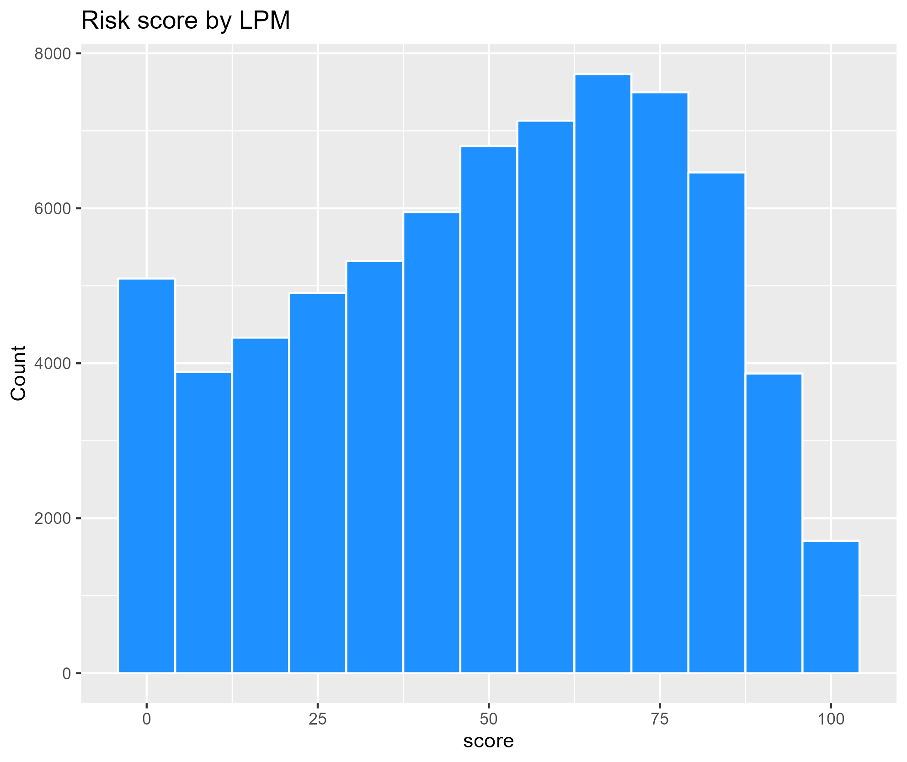
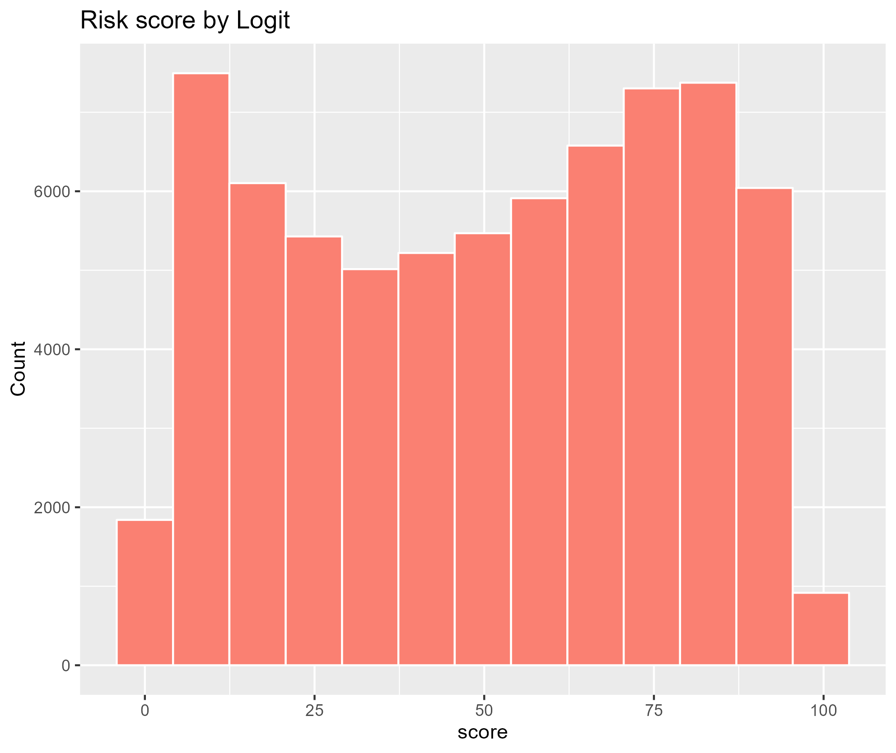
##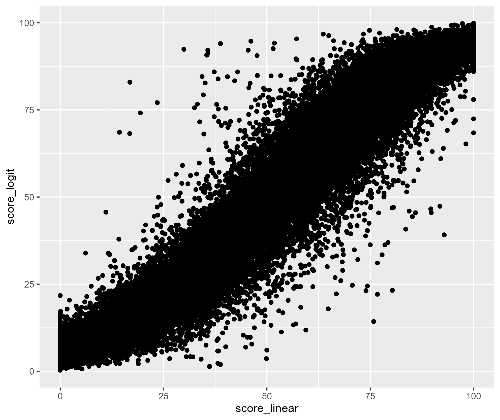
##knitr::kable(c(correlation=0.975))
```
where the correlation between predicted output in the linear model and the logit model is 0.975.

From the above graphs, the linear model is like the normal distribution that the top was biased to slightly the right. Also, the logit model is a distribution with a dent in the middle. The bottom of the graph shows the relationship between two ways to score, and these correlation is 0.975. 

Besides, we also saw the distribution of risk scores by thresholds and we got the overall results of the linear and the logit looked the same. ([see Appendix](## 5-4. The ratio of people who got risk scores by each thresholds))

From these result, whichever ways to score we select, almost scores are the same as another way. So, we can focus on the shape of the distribution for scores. In general, a scoring distribution will be normal hopefully because we have already had some uncertain conditions for this prediction, such as unknown factors or something like this. Also, the result of the logit model can distinguish diabetes or not as possibly, and many people gives scores of below 50 points compared to linear model. In practice, the scoring has a function of warning and so, we think many low score should not be given.

Accordingly, we think the linear probability model is better scoring model than logit.

## 3-3. Identifying factors affecting Diabetes: 

To identify the critical factors causing Diabetes, we used a correlation matrix, PCA analysis & variable importance plot (using a random forest model). 
The correlation matrix shows that there is a high positive correlation between Diabetes & High BP, High cholesterol, age, Heart disease, BMI & general health.

```{r, echo=FALSE,out.width ="90%", out.height = "90%",fig.align='center',fig.show="hold",fig.show="hold", fig.cap=paste("Correlation matrix in data")}
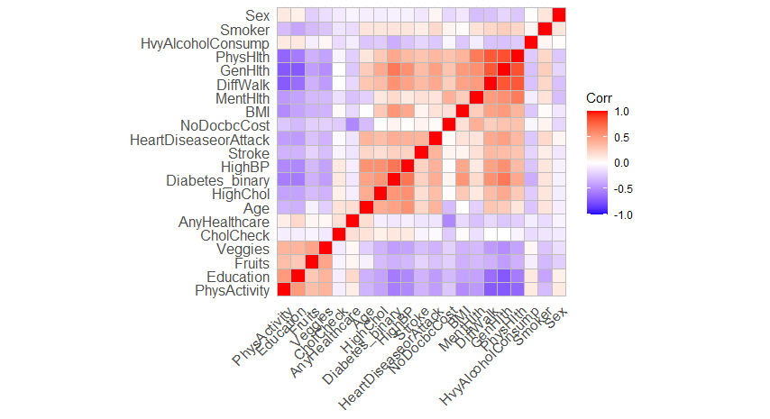
```

We have also identified 3 latent groups of variables:

The most important factors according to the PCA analysis are General Health, HighBP, HeartDiseaseorAttack, HighChol , BMI, Mental Health & Age.

Since the sample size is large, we ran 3 random sub-sample to evaluate the random forest model & identify the most important variables using the 'varImp plot'. The 3 different random forests gave us roughly similar important variables affecting diabetes. The variables based on importance are BMI, High BP, Age, General Health, Income, Education, Physical Activity, Mental Health, and High Cholesterol.

So, Using the correlation matrix, PCA analysis & the variable importance plot, we find that the most common factors affecting diabetes are: BMI, Age, General Health, High BP, Income level, Education level, Physical & Mental Health, presence of heart disease. 

In order to identify how these variables might affect the probability of developing diabetes, we ran a gradient boost model & found some interesting insights. For instance, the partial dependence plot shows that as the education level goes up, the probability of diabetes goes down. Probably educated people live a more disciplined life & can take better care of their diet and health. In fact, diabetes is prevalent among less educated people. The probability of diabetes goes up after age 55. The plot also suggests that A person will high cholesterol will have a 20% greater chance of developing diabetes. The higher the BMI, the higher the probability of catching diabetes. The prevalence of diabetes also goes down as the level of income goes up. As people earn a higher level of income, they can spend more on healthcare, can eat a healthy diet & live a better lifestyle. It is also believed that diabetes is a disease closely related to one's lifestyle. On the other hand, the probability of occurrence of diabetes goes up as a person rates his/her general health to be fair to poor.

## 3-4. What kind of variables is more helpful to refine our model?

```{r, echo=FALSE, message=FALSE, warning=FALSE, results='hide',eval=FALSE}
pubmed = read.csv("./data/PoPCites_Pubmed.csv", header=T)

# Drop blank row 1000rows -> 950 rows
data_pubmed = data.frame(pubmed$Abstract[!pubmed$Abstract==""])

token = list()
for (i in 1:nrow(data_pubmed)){
  token[i]= tokenize_words(data_pubmed[i,1], stopwords = stopwords::stopwords("en"))
}
## Remove duplicates ("de-dupe")
token_d = lapply(token, unique)
  
## Cast this variable as a special arules "transactions" class.
token_trans = as(token_d, "transactions")

## Cast this variable as a special arules "transactions" class.
token_rules = apriori(token_trans, 
	parameter=list(support=.02, confidence=.001))

png("./fig/plot_token.png")
plot(token_rules, method='two-key plot',jitter = 0)
dev.off()

token_graph = associations2igraph(subset(token_rules, lift>4), associationsAsNodes = FALSE)
igraph::write_graph(token_graph, file='./fig/token_graph.graphml', format = "graphml")
```


At first, as we mentioned at Model part, we used a priori function in R with support 0.02 and confidence 0.01 (see [Appendix to look at the support-confidence](## 5-4. Support-Confidence plot)). And with lift >4, we created data to show the node of the graph. Also when the following graph is enlarged, it has one node around the word "diabetes":

```{r, echo=FALSE,out.width ="80%", out.height = "80%",fig.align='center',fig.cap=paste("Nodes and words around the diabetes word")}
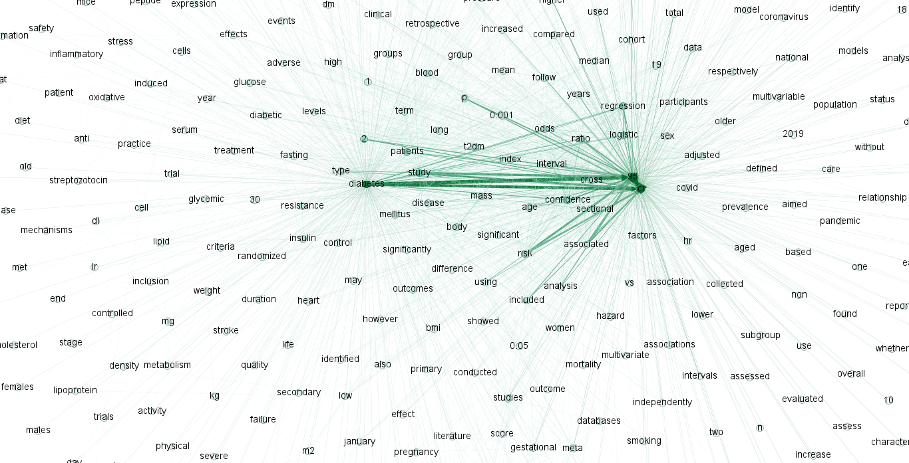
```

From this graph, we can get some factors which are not included in our data, but are related to diabetes like these:

- fasting <br>

- metabolic<br>

- blood glucose level<br>

- cholesterol level<br>

- stress<br>

- inflammatory<br>

- pregnancy<br>

Therefore, if we want to refine our model much more, it is better to get data included these factors additionally.

# 4. Conclusion

Here in this paper, to contribute decreasing diabetes, we have executed 4 analysis, (1) building the best predict diabetes model, (2) constructing the risk score for diabetes, **(3)--(Please insert here)--**, and (4) find other important factors that we have not yet obtained from academic paper(s).

For the first analysis, we used the stepwise selection to find the best linear probability model. From the result, we got the model with 92 variables (21 variables and 71 cross term variables), excluding the intercept terms, Also, we compared it to its KNN version's model with Cross Validation. Then, we found this linear model is better than its KNN model from the view of RMSE.

For the second analysis, we used the best linear probability model and the logit model with all variables data to construct the risk score for diabetes. The weight of the risk score are the coefficient of the linear probability model. So, we could get the crucial variables to increase the risk score of diabetes is High blood pressure" and "General health". And, the variable that does not related to the diabetes or make risk score decrease is "Heavy alcohol consumption". Besides, please be careful about BMI that increases risk scores as your "BMI" increase. Also, from the shape of the distribution between the probability model and the logit one, we thought the linear probability model is better to construct the risk score because its shape was closer to the normal distribution derived by the Law of the Large Number.

For the third analysis, we have used correlation matrix, PCA analysis & variable importance plot (using a random forest model) to identify the critical factors causing Diabetes. There the correlation matrix shows that there is a high positive correlation between Diabetes & High BP, High cholesterol, age, Heart disease, BMI, and also general health. 

For the fourth analysis, we used abstracts of  1000 medical academic papers from Pubmed to find other factors to sophisticate our model. In this analysis, with Natural Language Processing, we apply apriori function in R and created the node graph. Then, we got factors that related to "diabetes", and identified factors that we should collect additionally while comparing to our current factors of data. From the result, we found the key words that are related to "diabetes" academic paper. These key words are fasting, metabolic, blood glucose level, cholesterol level, stress, inflammatory, and pregnancy. We suggested to collect these kind of data to construct better predictive diabetes model.

# 5. Appendix
## 5-1. Charactersitcs of Data
In the following, we shows histograms counting of some characteristics by diabetes status from the raw data.
```{r, echo=FALSE,out.width ="45%", out.height = "45%",fig.align='center',fig.show="hold"}
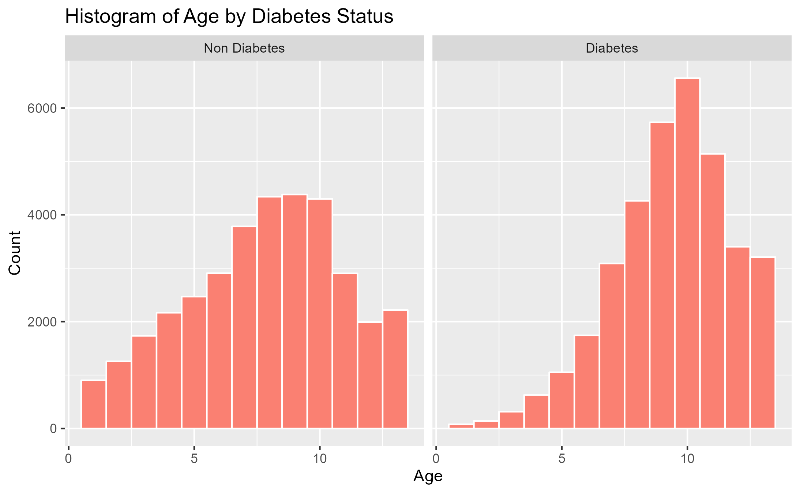
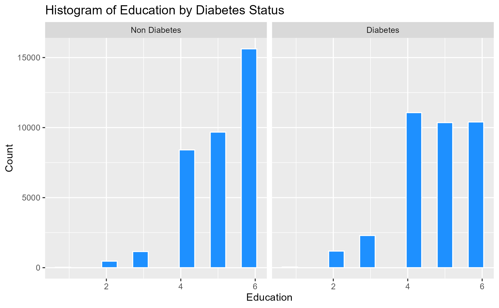
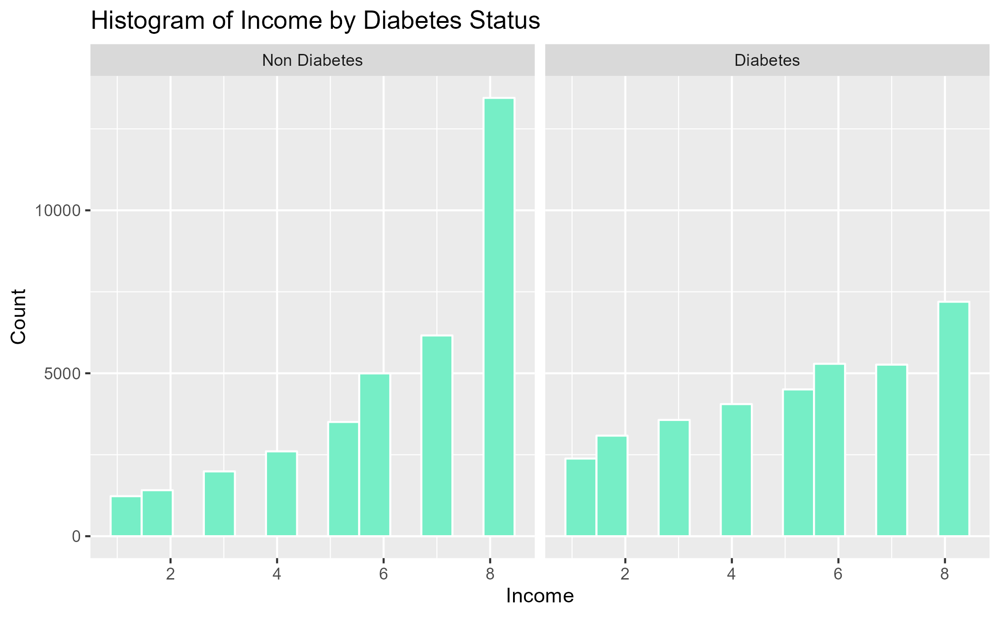
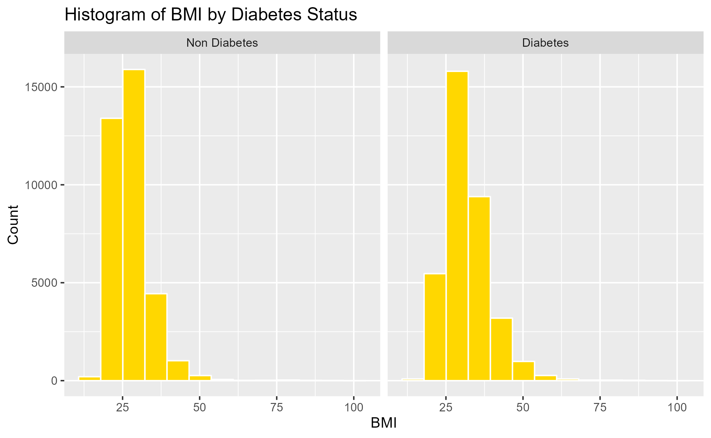
```

## 5-2. Stewise selection model
The model that we got from the stepwise selection in 3-1 is as follow:
$$
\begin{aligned}
 Diabetes_binary &= \beta_0 + \beta [ HighBP + HighChol + CholCheck +\\BMI + Smoker + 
     &Stroke + HeartDiseaseorAttack + PhysActivity + Fruits + Veggies \\+ 
     &HvyAlcoholConsump + AnyHealthcare + NoDocbcCost + GenHlth + \\
     &MentHlth + PhysHlth + DiffWalk + Sex + Age + Education + \\
     &Income + GenHlth\cdot DiffWalk \\& + BMI\cdot Age + Sex\cdot Age + HighChol\cdot Age +\\ 
   &GenHlth\cdot Income + BMI\cdot DiffWalk \\& + HighBP\cdot HeartDiseaseorAttack + \\
     &DiffWalk\cdot Age + GenHlth\cdot PhysHlth \\& + HvyAlcoholConsump\cdot Age + \\
     &CholCheck\cdot GenHlth + GenHlth\cdot Sex \\& + HighChol\cdot HeartDiseaseorAttack +\\ 
     &HighChol\cdot GenHlth + HeartDiseaseorAttack\cdot Age + Smoker\cdot GenHlth + \\
     &HeartDiseaseorAttack\cdot GenHlth \\& + Fruits\cdot Education + HeartDiseaseorAttack\cdot DiffWalk +\\&HighBP\cdot HvyAlcoholConsump \\& + HighChol\cdot Stroke + AnyHealthcare\cdot Education +\\ 
    & HighBP\cdot CholCheck + Smoker\cdot Education + BMI\cdot HeartDiseaseorAttack + \\
     &BMI\cdot Smoker + MentHlth\cdot DiffWalk \\& + CholCheck\cdot BMI + HighChol\cdot BMI + \\
     &HighBP\cdot HighChol + Fruits\cdot Age \\& + PhysActivity\cdot Fruits + Stroke\cdot GenHlth + \\ 
     &HighBP\cdot Sex + Stroke\cdot Age \\& + HeartDiseaseorAttack\cdot NoDocbcCost + \\
     &CholCheck\cdot Age + CholCheck\cdot HeartDiseaseorAttack \\& + Fruits\cdot Sex + \\
     &HvyAlcoholConsump\cdot GenHlth \\& + HighChol\cdot MentHlth \\& + HighBP\cdot AnyHealthcare + \\ 
     &HighBP\cdot Education + Smoker\cdot Stroke \\& + PhysActivity\cdot Age + PhysActivity\cdot Education + \\
     &CholCheck\cdot AnyHealthcare + Veggies\cdot NoDocbcCost + BMI\cdot Sex + \\
     &MentHlth\cdot Income + PhysHlth\cdot Income + NoDocbcCost\cdot DiffWalk + \\
     &BMI\cdot MentHlth + HighChol\cdot Sex \\& + Sex\cdot Education + Smoker\cdot Sex + \\
     &PhysHlth\cdot Age + MentHlth\cdot Age \\& + HeartDiseaseorAttack\cdot PhysHlth + \\ 
     &PhysActivity\cdot PhysHlth + Stroke\cdot MentHlth + BMI\cdot NoDocbcCost + \\
     &AnyHealthcare\cdot Age + BMI\cdot PhysActivity + Smoker\cdot DiffWalk + \\
     &Smoker\cdot Age + Smoker\cdot HvyAlcoholConsump \\& + AnyHealthcare\cdot DiffWalk +\\ 
     &AnyHealthcare\cdot PhysHlth + Stroke\cdot HeartDiseaseorAttack + \\ &PhysActivity\cdot Income]+\varepsilon \\
\end{aligned}
$$
The summary of the regression of the linear probability model is as follow:
```{r, echo=FALSE,out.width ="95%", out.height = "95%",fig.align='center'}

```

Also, the summary of the logit model is as follow:
```{r, echo=FALSE,out.width ="95%", out.height = "95%",fig.align='center'}

```

## 5-3. ROC curve
Besides, the ROC curves of the linear probability model and logit model is in the following.
```{r ,  eval=FALSE,include=FALSE}
roc = data.frame()
for (i in seq(0, 1, by = 0.01)){
  ## Linear Probability Model
  lm_db <- lm(Diabetes_binary~ HighBP + HighChol + CholCheck + BMI + Smoker + 
      Stroke + HeartDiseaseorAttack + PhysActivity + Fruits + Veggies + 
      HvyAlcoholConsump + AnyHealthcare + NoDocbcCost + GenHlth + 
      MentHlth + PhysHlth + DiffWalk + Sex + Age + Education + 
      Income + GenHlth:DiffWalk + BMI:Age + Sex:Age + HighChol:Age + 
      GenHlth:Income + BMI:DiffWalk + HighBP:HeartDiseaseorAttack + 
      DiffWalk:Age + GenHlth:PhysHlth + HvyAlcoholConsump:Age + 
      CholCheck:GenHlth + GenHlth:Sex + HighChol:HeartDiseaseorAttack + 
      HighChol:GenHlth + HeartDiseaseorAttack:Age + Smoker:GenHlth + 
      HeartDiseaseorAttack:GenHlth + Fruits:Education + HeartDiseaseorAttack:DiffWalk +
      HighBP:HvyAlcoholConsump + HighChol:Stroke + AnyHealthcare:Education + 
      HighBP:CholCheck + Smoker:Education + BMI:HeartDiseaseorAttack + 
      BMI:Smoker + MentHlth:DiffWalk + CholCheck:BMI + HighChol:BMI + 
      HighBP:HighChol + Fruits:Age + PhysActivity:Fruits + Stroke:GenHlth + 
      HighBP:Sex + Stroke:Age + HeartDiseaseorAttack:NoDocbcCost + 
      CholCheck:Age + CholCheck:HeartDiseaseorAttack + Fruits:Sex + 
      HvyAlcoholConsump:GenHlth + HighChol:MentHlth + HighBP:AnyHealthcare + 
      HighBP:Education + Smoker:Stroke + PhysActivity:Age + PhysActivity:Education + 
      CholCheck:AnyHealthcare + Veggies:NoDocbcCost + BMI:Sex + 
      MentHlth:Income + PhysHlth:Income + NoDocbcCost:DiffWalk + 
      BMI:MentHlth + HighChol:Sex + Sex:Education + Smoker:Sex + 
      PhysHlth:Age + MentHlth:Age + HeartDiseaseorAttack:PhysHlth + 
      PhysActivity:PhysHlth + Stroke:MentHlth + BMI:NoDocbcCost + 
      AnyHealthcare:Age + BMI:PhysActivity + Smoker:DiffWalk + 
      Smoker:Age + Smoker:HvyAlcoholConsump + AnyHealthcare:DiffWalk + 
      AnyHealthcare:PhysHlth + Stroke:HeartDiseaseorAttack + PhysActivity:Income, data = data_cv)
  phat_test_lm = predict(lm_db, data_cv, type='response')
  yhat_test_lm = ifelse(phat_test_lm > i, 1, 0)
  confusion_out_lm = table(y = data_cv$Diabetes_binary ,yhat = yhat_test_lm )
  ## Logit Model
  logit_db <- glm(Diabetes_binary~ ., data = data_cv, family=binomial)
  phat_test_logit = predict(logit_db, data_cv, type='response')
  yhat_test_logit = ifelse(phat_test_logit> i, 1, 0)
  confusion_out_logit = table(y = data_cv$Diabetes_binary, yhat = yhat_test_logit)
  ## TPR
  TPR_lm = tryCatch({
    (confusion_out_lm[2,2])/(confusion_out_lm[2,1]+confusion_out_lm[2,2])},error=function(e) {"."})
  TPR_logit = tryCatch({ (confusion_out_logit[2,2])/(confusion_out_logit[2,1]+confusion_out_logit[2,2])}, error=function(e) {"."})
  ## FPR
  FPR_lm = tryCatch({(confusion_out_lm[1,2])/(confusion_out_lm[1,1]+confusion_out_lm[1,2])}, error=function(e) {"."})
  FPR_logit = tryCatch({(confusion_out_logit[1,2])/(confusion_out_logit[1,1]+confusion_out_logit[1,2])},error=function(e) {"."})
  roc = rbind(rbind(c(i,TPR_lm,TPR_logit,FPR_lm,FPR_logit)),roc)
}
colnames(roc) <- c("TPR_lm","TPR_logit","FPR_lm","FPR_logit")
roc2 =data.frame(cbind(TPR_lm=as.numeric(roc[2:100,]$TPR_lm),FPR_lm=as.numeric(roc[2:100,]$FPR_lm), TPR_logit=as.numeric(roc[2:100,]$TPR_logit), FPR_logit=as.numeric(roc[2:100,]$FPR_logit)))

ggplot(roc2)+geom_line(aes(x=FPR_lm,y=TPR_lm),colour="red")+geom_line(aes(x=FPR_logit,y=TPR_logit),color="blue")+
  ggtitle("ROC curve:linear vs logit")
ggsave("./fig/roc.png")
```

```{r, echo=FALSE,out.width ="50%", out.height = "50%",fig.align='center', fig.cap=paste("ROC Curves between the logit and the probit")}
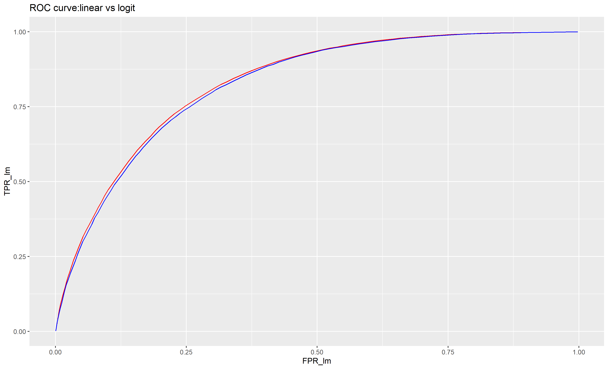
```
The red line of this graph represents the best linear model and the blue line represents the logit model. These gaps are so little but the linear model is slightly better than that the logit model.


## 5-4. Ratio of people who got risk scores by each thresholds
```{r, echo=FALSE,out.width ="50%", out.height = "50%",fig.align='center'}
linear=c(low=22.3, moderate=23.4, high=30.2, veryhigh=20.1)
logit=c(low=25.6, moderate=21.3, high=25.9, veryhigh=20.9)
knitr::kable(cbind(linear,logit),caption = "The ratio of people who got risk scores by each thresholds (%: all observations n= 70692)")
```
We saw the distribution of risk scores by thresholds which means low score is below 25 points, moderate score is over 26 and below 50 points, high score is over 51 and below 75 points, and very high score is over 76 points. The above table shows the ratio of the number of people who get each score overall observations. The ratio of people who got high scores is 30.2% in the linear model and 25.9% in the logit model, which looks like a large differenece. Similarly, The ratio of people who got low scores is 22.3% in the linear model and 25.6% in the logit model. However, the overall results seem to be the same.

## 5-5. 

```{r, echo=FALSE, message=FALSE, warning=FALSE, results='hide',eval=FALSE}
#  we created a correlation plot to identify the variables that have high correlation with diabetes.
diabetes1 <- diabetes[, c(1:21)]
corr_matrix <- cor(diabetes1)
ggcorrplot::ggcorrplot(cor(corr_matrix), hc.order = TRUE)
#We applied the PCA analysis for Diabetes. Here based on the correlation map, we identified 3 latent groups for PCA. 
PCAdiabetes = prcomp(diabetes1, scale=TRUE, rank=3)
plot(PCAdiabetes)
summary(PCAdiabetes)
round(PCAdiabetes$rotation[,1:3],2) 

loadings_summary = PCAdiabetes$rotation %>%
  as.data.frame()
loadings_summary %>%
    arrange(desc(PC1))

loadings_summary %>%
    arrange(desc(PC2))

loadings_summary %>%
    arrange(desc(PC3))
# We created 3 different subsample to run Random Forest Models & the respective variable importance plot. 
Diabetes.1 <- read.csv("./data/Diabetes1.csv")
Random_Forest1=randomForest(Diabetes_binary ~.,data =Diabetes.1)
varImpPlot(Random_Forest1, main = "Imoprtant factors affecting Diabetes")

Diabetes.2 <- read.csv("./data/Diabetes2.csv")
Random_Forest2=randomForest(Diabetes_binary ~.,data =Diabetes.2)
varImpPlot(Random_Forest2, main = "Imoprtant factors affecting Diabetes")

#Diabetes3 <- read.csv("./data/Diabetes3.csv")
#Random_Forest3=randomForest(Diabetes_binary ~.,data =Diabetes3)
#varImpPlot(Random_Forest3, main = "Imoprtant factors affecting Diabetes")

#Partial Dependence Plots using the Boost model:
Boost=gbm(Diabetes_binary ~., data = diabetes, interaction.depth=4, n.trees=500, shrinkage=.05)
plot(Boost,'GenHlth')
plot(Boost,'HighBP')
plot(Boost,'BMI')
plot(Boost,'HighChol')
plot(Boost,'Age')
plot(Boost,'Income')
plot(Boost,'Education')
```

```{r, echo=FALSE,out.width ="45%", out.height = "45%",fig.align='center',fig.show="hold"}
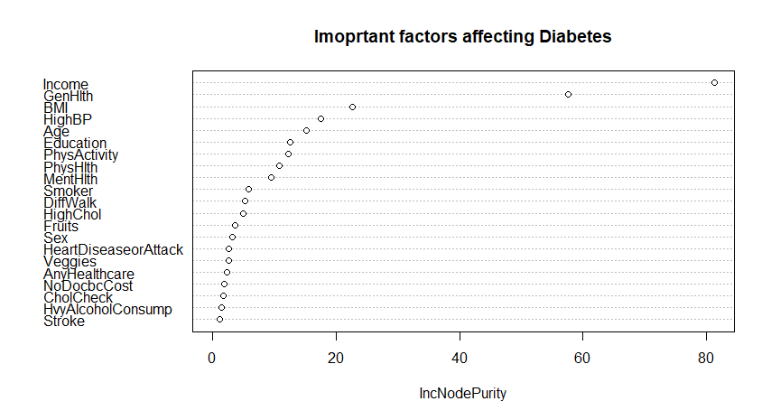
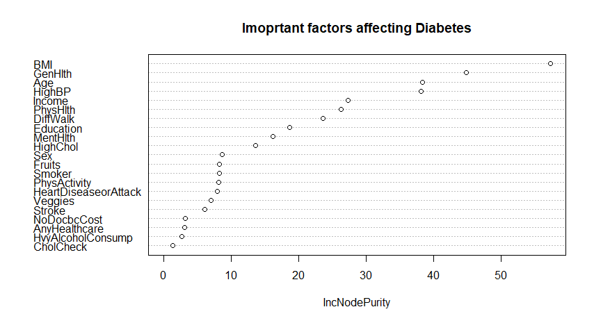
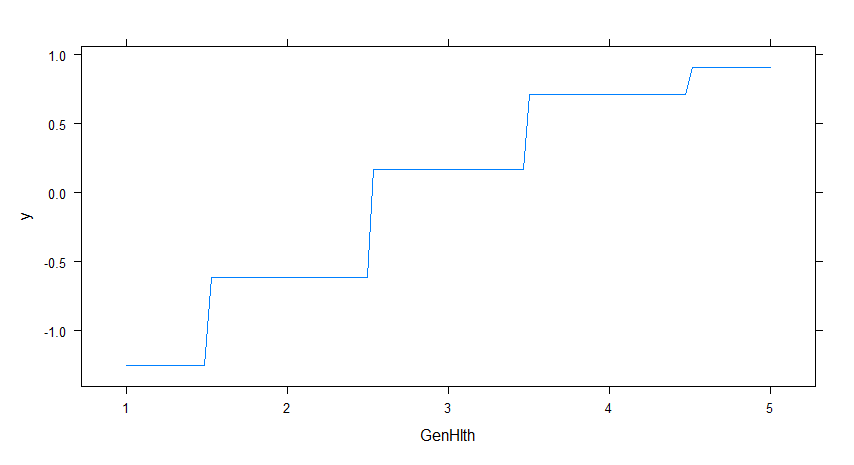
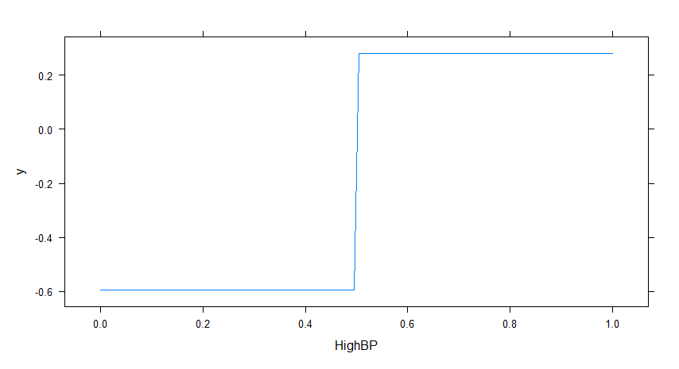
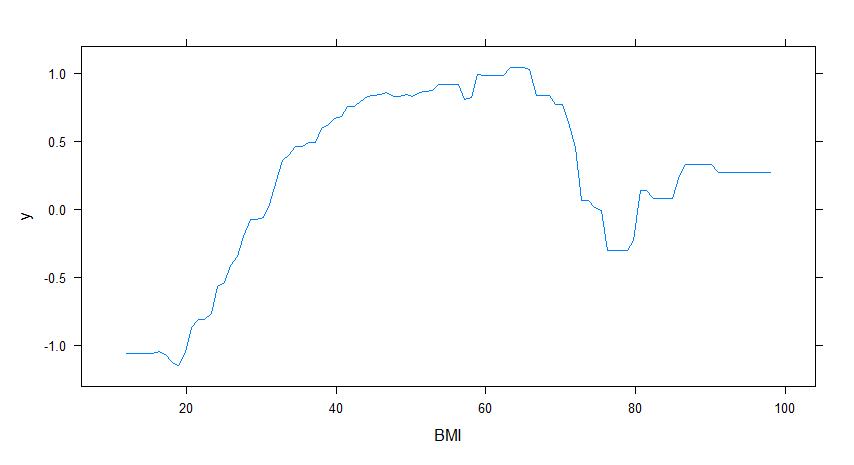
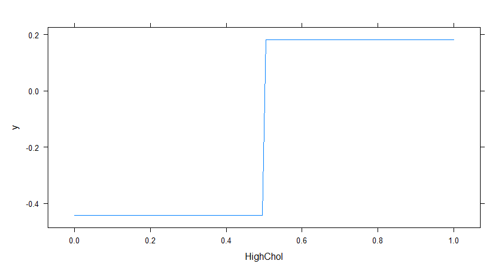
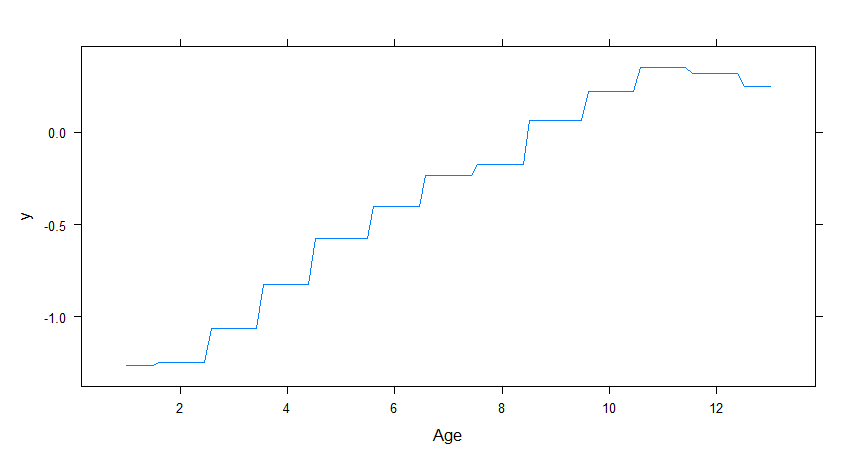
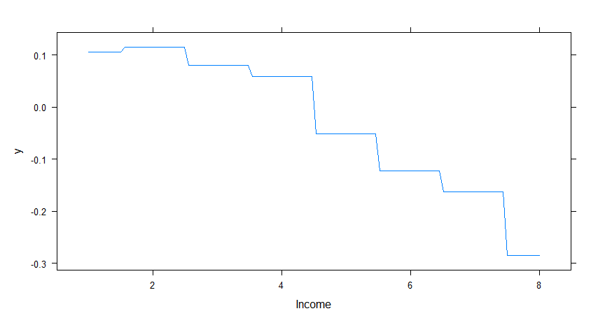
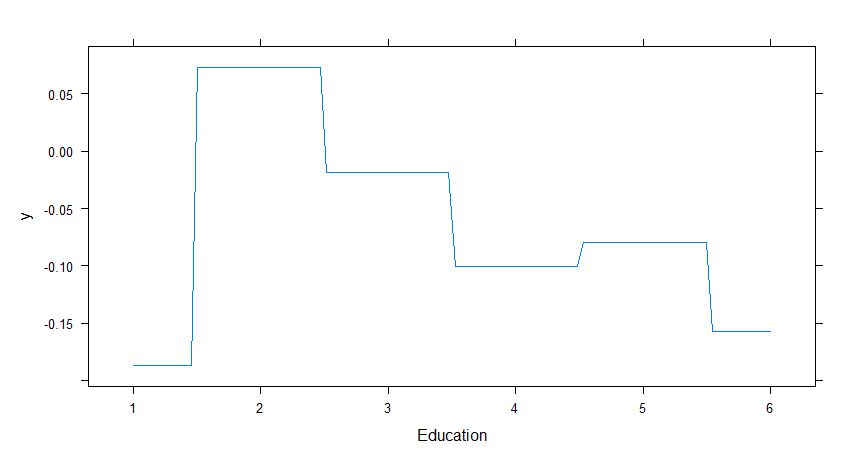
```
## 5-6. Support-Confidence plot
The support-confidence plot at the section 3-4 is as follow: 
```{r, echo=FALSE,out.width ="40%", out.height = "40%",fig.align='center'}
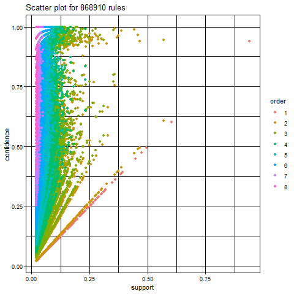
```
It seems that many data is tend be on the side of the confidence level. Note that although we tried to do low confidence level, the result mostly does not change.