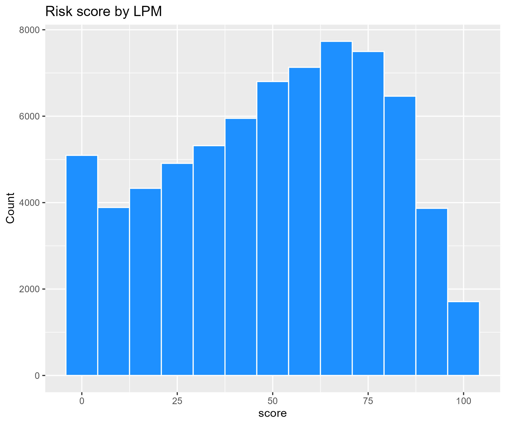
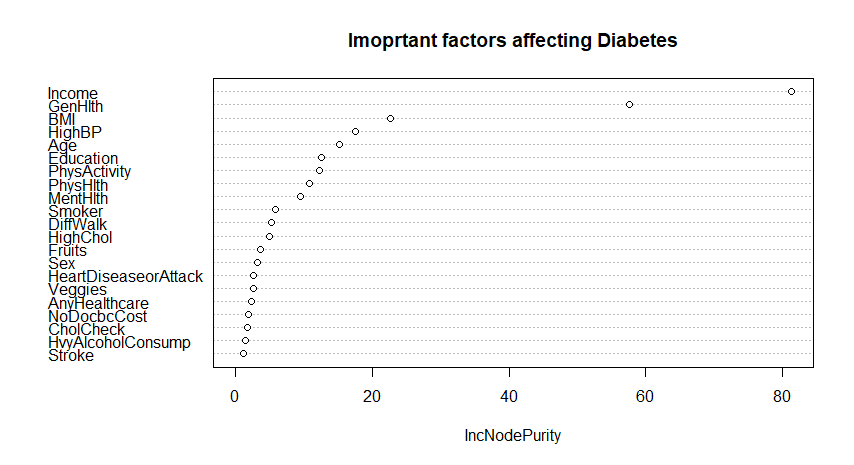
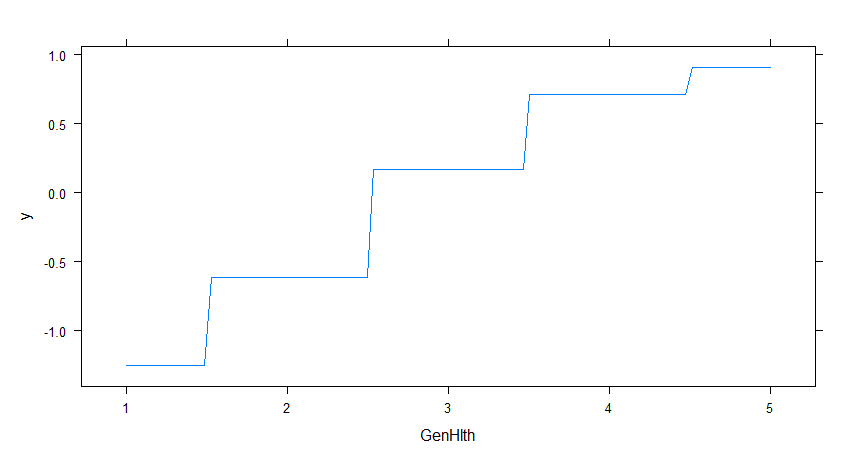
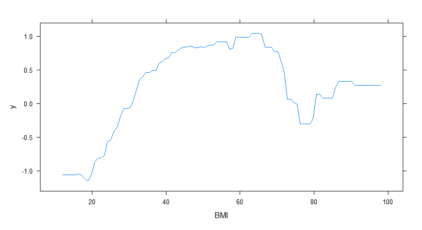
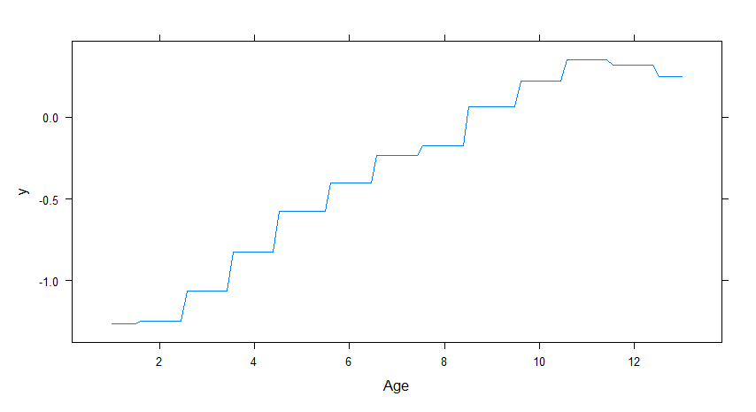
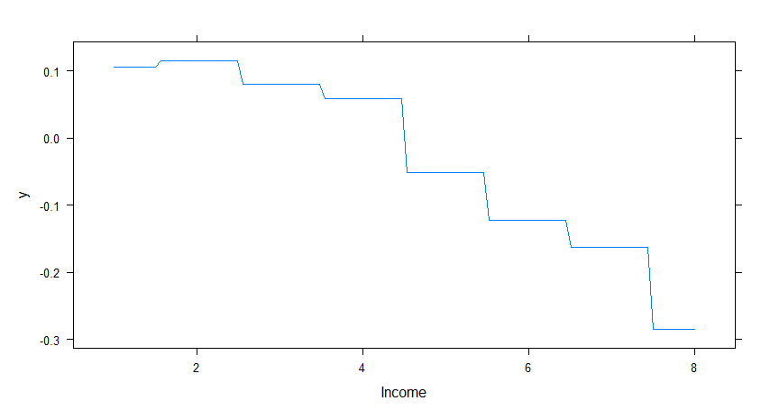
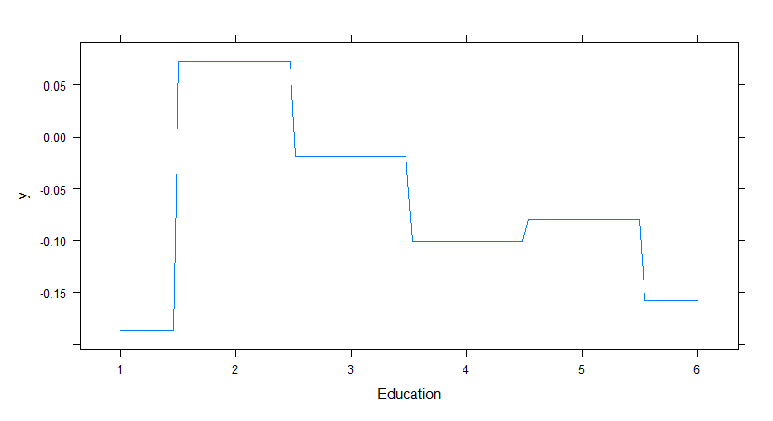
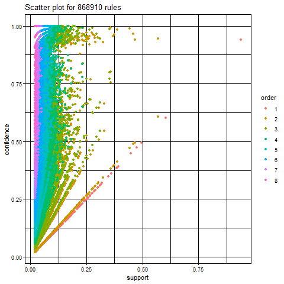

# 1. Introduction

## 1-1. Background

Diabetes is a prevalent chronic disease in the US. It is characterized
by the inability to regulate glucose levels in the blood due to
insufficient insulin production or ineffective use of insulin. High
blood sugar levels can lead to complications such as heart disease,
vision loss, lower-limb amputation, and kidney disease. While there is
no cure for diabetes, lifestyle changes and medical treatments can help
mitigate its harms. Early diagnosis is important, and predictive models
for diabetes risk can aid public health officials. Type II diabetes is
the most common form, and its prevalence varies by social determinants
of health such as age, education, income, race, and location. Diabetes
also has a disproportionate impact on those of lower socioeconomic
status. The economic burden of diabetes is significant, with costs
exceeding $400 billion annually.

Here are some statistics on diabetes in the USA: 

-   As of 2021, approximately 34.2 million Americans, or 10.5% of the
    population, have diabetes. 

-   About 90-95% of cases are type II diabetes. 

-   Another 88 million American adults, or 34.5% of the population, have
    prediabetes. 

-   1 in 5 people with diabetes, and 8 in 10 people with prediabetes,
    are unaware of their condition. 

-   Diabetes is the seventh leading cause of death in the United
    States. 

-   In 2017, the total cost of diagnosed diabetes in the United States
    was estimated to be $327 billion. 

So given these statistics, we know that it is important to identify the
key factors that lead to diabetes. If we can develop a predictive model
that gives an idea how we can predict the chance of developing diabetes,
we can take necessary actions to prevent diabetes. The finding will be
quite useful for patients, healthcare providers or physicians as this
disease is not curable. So people can take necessary actions accordingly
to prevent this chronic disease.

## 1-2. Our Objectives and findings

**The objectives of this paper are as follow:**

-   Can we develop a predictive model of diabetes? 

-   Can we assign a risk score for an individual given we know his/her
    individual biological & demographic characteristics? 

-   What risk factors are most predictive of diabetes risk? 

**Our findings will be useful for the following stakeholders:**

-   Patients: Diabetes models can help patients understand their risk of
    developing the disease, make informed lifestyle choices, and take
    steps to prevent or manage the disease. 

-   Healthcare providers: Predictive models can help healthcare
    providers identify patients who are at high risk of developing
    diabetes, allowing for earlier interventions and better disease
    management. 

-   Public health officials: Modeling diabetes can help public health
    officials understand the patterns and trends of the disease,
    identify populations at high risk, and develop targeted prevention
    and treatment strategies. 

-   Researchers: By analyzing data from diabetes models, researchers can
    gain insights into the underlying causes of the disease, identify
    new risk factors, and develop more effective treatments. 

# 2. Methods: Data and Model

## 2-1. Data

**Nature of Data:** Dataset includes 70,692 observations of US
individuals. [These data were collected by BEHAVIORAL RISK FACTOR
SURVEILLANCE SYSTEM in assistance with Chronic Disease
Center](https://www.kaggle.com/datasets/alexteboul/diabetes-health-indicators-dataset).
There are total 21 variables. There are a total 21 variables. The
variables are defined as follows:

*Diabetes\_binary*: A binary variable indicating presence of diabetes by
1 & absence by 0.

*HighBP,HighChol*(Have you smoked at least 100 cigarettes in your entire
life? 0 = no 1 = yes), **Stroke, HeartDisease PhysActiv, Fruits,
Veggies, HvyAlcoholConsump, AnyHealthcare, NoDocbcCost, DiffWalk** (Any
difficulty on walking, 1 indicate presence of difficulty) - all are
binary variables where 1 indicate presence of the factor and 0 indicates
absence. Cholcheck is also a binary variable where 0 = no cholesterol
check in 5 years 1 = yes cholesterol check in 5 years

*BMI:* Body Mass index is a measure of body fat based on height and
weight that applies to adult men and women. Here, BMI had a minimum
value of 12 & maximum value of 98. BMI more than 25 is considered obese.

**General Health:** A measure of general health situation in which
1=Excellent, 2=Very Good, 3=Good, 4=Fair, 5=Poor.

*Mental Health:* During the past 30 days, for about how many days did
poor physical or mental health keep an individual from doing your usual
activities, such as self-care, work, or recreation? A value from 0 to 30
where 0 indicates best mental health & 30 indicates worst.

*Physical Health:* for how many days during the past 30 days was the
individual’s physical health not good? Responses range from 0 to 30
where higher the value worse the physical health.

**Demographic Variables:**

*Sex:* patient’s gender (1: male; 0: female).

*Age:* 13-level age category ,where 1 = 18-24, 2=25-29, 3= 30-34,
4=35-39, 5=40-44, 6=45-49, 7=50-54, 8=55-59, 9=60-64, 10=65-69,
11=70-74, 12 = 75-79 & 13 = 80 or older etc.

*Education:* A value that ranges from 1 to 6. Higher value indicates
higher level of education. 1= Never attended school or only
kindergarten, 2 = Grades 1 through 8 (Elementary) 3 =Grades 9 through 11
(Some high school), 4= Grade 12 or GED (High school graduate), 5=
College 1 year to 3 years (Some college or technical school), 6= College
4 years or more (College graduate)

*Income:* Indicates level of annual income for the households where 1=
income less than $10000, 2= $ 10,000 to less than $15,000, 3= $15,000 to
less than $20,000, 4= $20,000 to less than $25,000, 5= $25,000 to less
than $35,000, 6= $35,000 to less than $50,000, 7= $50,000 to less than
$75,000, 8= $75,000 or more

[please see the specific characteristic of the
data](##%205-1.%20Charactersitcs%20of%20Data)

## 2-2. Model

### 2-2-1. Best Predictive Model

Using different predictive models such as linear regression, KNN
regression & logistic regression, we will develop a model which is the
best for predicting diabetes.

### 2-2-2. Scoring

Based on the best predictive model, we will develop a risk score & based
on the risk score we can give an early signal about the degree of risk
exposure a person may have.

We have followed the following steps:

1.  Use the estimated coefficients

we used the estimated coefficients the detail (see [the Appendix
5-2.](##%205-2.%20Stepwise%20selection%20model)) to estimate the
probability of diabetes for individuals with a linear probability model
and the logit model.
$$
\begin{aligned}
\hat{y}= \beta\_0+\beta\_1 (each\\ variables)+ \beta\_2 (cross\\ temrs(only\\ LPM))
\end{aligned}
$$

1.  100 scaled (for only the Linear Probability model)

To show *ŷ* as a score in the linear probability model, we scaled it
into the format 0-100 points.
$$
\begin{aligned}
score&= 100\hat{y}\\\\ where\\ &if\\ \hat{y}&gt;100,\\ then\\ score=100\\\\
&if \hat{y}&lt;0,\\ then\\ score=0
\end{aligned}
$$

1.  Risk score:

We defined and classified the risk score for individuals: 0-25=”Low
Risk”, 26-50=”Moderate Risk”, 51-75= “High Risk”, 76-100=”Very High
Risk”

### 2-2-3. Identifying critical factors responsible for diabetes

We have used correlation matrix, PCA, partial dependence plot etc to
identify the factors responsible for diabetes.

### 2-2-4. Factors related to “diabetes”

We used the Natural Language Processing to identify factors that are
much related to “diabetes”. This is because if we can get additionally
data of them, we can estimate our model more preciously.

To do that, at first, we collected data of the abstract of the recent
academic paper with the keyword “diabetes” from the
[Pubmed](https://pubmed.ncbi.nlm.nih.gov/). Specifically, we used the
application of [Publish or Perish
8](https://harzing.com/resources/publish-or-perish/), put “diabetes”
into the “Keywords” and get information of the 1000 medical papers with
“diabetes” keyword from 2022 to 2023.

Next, we excluded blank data and stopwords of “stopwords” library, and
tokenized their abstracts using “tokenizers” library. So there were 950
papers.

After that, we applied “apriori” function for data that we got with
support =.02, confidence=.001, and extract some data from them with
lift&gt;4. Then we showed the node graph that told us words that related
to “diabetes” word with [Gephi](https://gephi.org/).

Finally, from the node graph, we got factors that are related to
“diabetes”, and identified the additional factors while comparing them
to our current factors of data.

Note: We did not use “Google Scholar” to collect in Publish or Perish as
it did not give us all the abstract data of each paper. Also, Publish or
Perish can only get up to 1000 data.

# 3. Results

## 3-1. Best Prediction Model for Diabetes

### 3-1-1. Linear model regression and KNN regression

First, to find the best combination of variables for the model, we used
stepwise selection. We got the best model based on AIC criteria, which
is so complex that we have shown it in [the Appendix
5-2.](##%205-2.%20Stepwise%20selection%20model).

We also compared three models with the cross-Validation namely - the
stepwise linear model, the basic model (which simply includes all
variables), and the KNN regression model. Rmse of three models are as
given below:

<table>
<caption>Comparison of LPM and KNN model</caption>
<thead>
<tr class="header">
<th style="text-align: right;">RMSE_stndard</th>
<th style="text-align: right;">RMSE_step</th>
<th style="text-align: right;">RMSE_KNN</th>
</tr>
</thead>
<tbody>
<tr class="odd">
<td style="text-align: right;">0.415</td>
<td style="text-align: right;">0.411</td>
<td style="text-align: right;">0.5</td>
</tr>
</tbody>
</table>

Comparison of LPM and KNN model

where the optimal k is 2. From the above result, it is safe to say the
stepwise model is the best predictive model so far.

### 3-1-2. Logit model comparison

To find better predictive model, we compared the LPM & Logit models:

<table>
<caption>Comparison of LPM and Logit</caption>
<thead>
<tr class="header">
<th style="text-align: left;"></th>
<th style="text-align: right;">Linear</th>
<th style="text-align: right;">Logit</th>
</tr>
</thead>
<tbody>
<tr class="odd">
<td style="text-align: left;">accuracy</td>
<td style="text-align: right;">0.753</td>
<td style="text-align: right;">0.748</td>
</tr>
<tr class="even">
<td style="text-align: left;">TPR</td>
<td style="text-align: right;">0.790</td>
<td style="text-align: right;">0.768</td>
</tr>
<tr class="odd">
<td style="text-align: left;">FPR</td>
<td style="text-align: right;">0.282</td>
<td style="text-align: right;">0.272</td>
</tr>
<tr class="even">
<td style="text-align: left;">FDR</td>
<td style="text-align: right;">0.263</td>
<td style="text-align: right;">0.253</td>
</tr>
</tbody>
</table>

Comparison of LPM and Logit

From these tables, the accuracy rate of the linear model is
0.753(=75.3%) and that of the logit model is 0.748(=74.8%). Also, each
true positive rate (TPR) is 0.79 and 0.768, each false positive rate
(FPR) is 0.282 (=Specificity: 70.8%) and 0.272 (=Specificity: 72.8%),
and each false discovery rate (FDR) is 0.263 (=Precision: 73.7%) and
0.253 (=Precision: 74.7%).

Besides, The ROC curves shows that the linear model is slightly better
than that the logit model (see [the Appendix
5-3.](##%205-3.%20ROC%20curves)).

From the result, we see that the linear model is better than the logit
model because the linear model has the lowest RMSE and the greater
ability to predict diabetes. However, we need to be careful because
sometimes the logit model might be better.

## 3-2. Scoring

### 3-2-1. What the crucial variables are to directly affect on the risk score?

From the linear probability model, we retrieve the coefficients as the
weights of the risk score. Based on the coefficients, the direct
marginal effects on the risk score are as follow:

<table>
<caption>Coefficients(Weights) of LPM and Logit model</caption>
<thead>
<tr class="header">
<th style="text-align: left;"></th>
<th style="text-align: right;">linear</th>
<th style="text-align: right;">logit</th>
</tr>
</thead>
<tbody>
<tr class="odd">
<td style="text-align: left;">HighBP</td>
<td style="text-align: right;">7.14e-02</td>
<td style="text-align: right;">0.365000</td>
</tr>
<tr class="even">
<td style="text-align: left;">HighChol</td>
<td style="text-align: right;">5.28e-02</td>
<td style="text-align: right;">0.293000</td>
</tr>
<tr class="odd">
<td style="text-align: left;">CholCheck</td>
<td style="text-align: right;">3.46e-02</td>
<td style="text-align: right;">0.211000</td>
</tr>
<tr class="even">
<td style="text-align: left;">BMI</td>
<td style="text-align: right;">8.71e-02</td>
<td style="text-align: right;">0.538000</td>
</tr>
<tr class="odd">
<td style="text-align: left;">Smoker</td>
<td style="text-align: right;">-6.22e+00</td>
<td style="text-align: right;">-0.000839</td>
</tr>
<tr class="even">
<td style="text-align: left;">Stroke</td>
<td style="text-align: right;">1.67e-02</td>
<td style="text-align: right;">0.039100</td>
</tr>
<tr class="odd">
<td style="text-align: left;">HeartDiseaseorAttack</td>
<td style="text-align: right;">3.81e-02</td>
<td style="text-align: right;">0.089700</td>
</tr>
<tr class="even">
<td style="text-align: left;">PhysActivity</td>
<td style="text-align: right;">-6.46e+00</td>
<td style="text-align: right;">-0.015100</td>
</tr>
<tr class="odd">
<td style="text-align: left;">Fruits</td>
<td style="text-align: right;">-2.30e-03</td>
<td style="text-align: right;">-0.016800</td>
</tr>
<tr class="even">
<td style="text-align: left;">Veggies</td>
<td style="text-align: right;">-4.15e-03</td>
<td style="text-align: right;">-0.024900</td>
</tr>
<tr class="odd">
<td style="text-align: left;">HvyAlcoholConsump</td>
<td style="text-align: right;">-4.91e+00</td>
<td style="text-align: right;">-0.152000</td>
</tr>
<tr class="even">
<td style="text-align: left;">AnyHealthcare</td>
<td style="text-align: right;">-3.62e-05</td>
<td style="text-align: right;">0.012600</td>
</tr>
<tr class="odd">
<td style="text-align: left;">NoDocbcCost</td>
<td style="text-align: right;">-8.20e-04</td>
<td style="text-align: right;">0.005540</td>
</tr>
<tr class="even">
<td style="text-align: left;">GenHlth</td>
<td style="text-align: right;">1.14e-01</td>
<td style="text-align: right;">0.651000</td>
</tr>
<tr class="odd">
<td style="text-align: left;">MentHlth</td>
<td style="text-align: right;">-6.83e-03</td>
<td style="text-align: right;">-0.035600</td>
</tr>
<tr class="even">
<td style="text-align: left;">PhysHlth</td>
<td style="text-align: right;">-1.31e-03</td>
<td style="text-align: right;">-0.083700</td>
</tr>
<tr class="odd">
<td style="text-align: left;">DiffWalk</td>
<td style="text-align: right;">2.77e-02</td>
<td style="text-align: right;">0.050000</td>
</tr>
<tr class="even">
<td style="text-align: left;">Sex</td>
<td style="text-align: right;">2.14e-02</td>
<td style="text-align: right;">0.133000</td>
</tr>
<tr class="odd">
<td style="text-align: left;">Age</td>
<td style="text-align: right;">4.12e+00</td>
<td style="text-align: right;">0.434000</td>
</tr>
<tr class="even">
<td style="text-align: left;">Education</td>
<td style="text-align: right;">-7.62e-03</td>
<td style="text-align: right;">-0.037900</td>
</tr>
<tr class="odd">
<td style="text-align: left;">Income</td>
<td style="text-align: right;">-2.52e-02</td>
<td style="text-align: right;">-0.128000</td>
</tr>
</tbody>
</table>

Coefficients(Weights) of LPM and Logit model

Here, these coefficients are the result of the estimation with scaled
data (if you want to see all coefficients, see [the Appendix
5-2.](##%205-2.%20Stepwise%20selection%20model)). Among the binary
variables, the highest weight is assigned to “HighBP”(high blood
pressure) and the lowest one is assigned to “HvyAlcoholConsump” (heavy
alcohol consumption). Outside the dummy variables, BMI seems to largely
affect the risk score.

In the logit model, among the binary variables, “GenHlth”(general
health) has the highest weight/coefficient and “HvyAlcoholConsump”
(heavy alcohol consumption) has the lowest weight/coefficient. In
addition to that, BMI seems to affect the risk score largely in logit
model as well. We also note that the coefficient of HighBP is still
positive and large. In both models, Physical activities, diets rich in
fruits & vegetables have negative weights as these variables reduce the
risk of diabetes.

From the above result, the crucial variables to increase the risk score
of diabetes from the viewpoint of the linear model and logit model is
**High blood pressure” and “General health”**. And, the variable that
does not related to the diabetes or make risk score decrease is **“Heavy
alcohol consumption”**. Besides, please be careful about **“BMI”** that
increases risk scores as your BMI increase.

Note that we shows the ratio of the number of people by each scoring
thresholds in [the Appendix
5-4.](##%205-4.%20Ratio%20of%20people%20who%20got%20risk%20scores%20by%20each%20thresholds)

### 3-2-2. Which risk socre model is better between LPM and Logit?

Next we will discuss, between LPM and Logit , which risk score model is
better . Here, we have shown the distribution of the predicted risk
scores from the actual data :

Distribution of scores by the linear and the logit

The correlation between predicted output in the linear model and the
logit model is 0.975. From the graphs, we observe that the linear model
roughly follows a normal distribution while top scores are slightly
tilted to the right. Also, the logit model is a distribution with a dent
in the middle. The correlation of the scores of these two predictive
models is 0.975.

From these results we observe that the predicted scores under the two
models are almost the same. So, we can focus on the shape of the
distribution for scores. We think that a scoring distribution will be
desirable to be normal because if there is the true score for diabetes,
the distributed independent samples will be closer to from the Central
Limit Theorem as the sample will be larger. Also, if we assume this
distribution as a normal, we can easily use this score for other
purposes.

We have already found that the linear probability model is a better
scoring model than logit.

## 3-3. Identifying factors affecting Diabetes:

To identify the critical factors causing Diabetes, we used a correlation
matrix, PCA analysis & variable importance plot (using a random forest
model). The correlation matrix shows that there is a high positive
correlation between **Diabetes & High BP, High cholesterol, age, Heart
disease/attack, & stroke**.

Correlation matrix in data

We have also identified 3 latent groups of variables:

The most important factors according to the PCA analysis are General
Health, HighBP, HeartDiseaseorAttack, HighChol , BMI, Mental Health &
Age.

Since the sample size is large, we ran 2 random subsample to evaluate
the random forest model & identify the most important variables using
the ‘varImp plot’ (see [the Appendix
5-5.](##%205-5.%20Variable%20Importance%20Plot%20based%20on%20Random%20Forest%20Model%20&%20Partial%20Dependence%20Plot%20based%20on%20Boost%20Model).
The 2 different random forests gave us roughly similar important
variables affecting diabetes. The variables based on importance are
**BMI, High BP, Age, General Health, Income, Education, Physical
Activity, Mental Health, and High Cholesterol.**

So, Using the correlation matrix, PCA analysis & the variable importance
plot, we find that the most common factors affecting diabetes are:
**BMI, Age, General Health, High BP, Income level, Education level,High
cholesterol & Heart Disease.**

In order to identify how these variables might affect the probability of
developing diabetes, we ran a gradient boost model & found some
interesting insights. For instance, the **partial dependence plot** (see
[the Appendix
5-5.](##%205-5.%20Variable%20Importance%20Plot%20based%20on%20Random%20Forest%20Model%20&%20Partial%20Dependence%20Plot%20based%20on%20Boost%20Model))
shows that as the **education level** goes up, the probability of
diabetes goes down. Probably educated people live a more disciplined
life & can take better care of their diet and health. In fact, diabetes
is prevalent among less educated people. The probability of diabetes
goes up after **age** 55. The plot also suggests that A person with
**high cholesterol** will have a 20% greater chance of developing
diabetes. The higher the BMI, the higher the probability of catching
diabetes. The prevalence of diabetes also goes down as the **level of
income** goes up. As people earn a higher level of income, they can
spend more on healthcare, can eat a healthy diet & live a better
lifestyle. It is also believed that diabetes is a disease closely
related to one’s lifestyle. On the other hand, the probability of
occurrence of diabetes goes up as a person rates his/her **general
health** fair or poor.

## 3-4. What kind of variables is more helpful to refine our model?

At first, as mentioned in the Model part, we used apriori function in R
with support 0.02 and confidence 0.01 (see [the Appendix
5-6.](##%205-6.%20Support-Confidence%20plot)) to look at the
support-confidence. And with lift &gt;4, we created data to show the
node graph. the following graph is enlarged it around the word
“diabetes”:

Nodes and words around the diabetes word

From this graph, we can get some factors which are not included in our
data are related to diabetes like these:

-   fasting  

-   metabolic 

-   blood glucose level 

-   cholesterol level 

-   stress 

-   inflammatory 

-   pregnancy 

Therefore, if we want to refine our model in future, it is better to
include these additional factors.

# 4. Conclusion

In this paper, we wanted to build a predictive model of diabetes. We
used stepwise selection to find the best linear probability model. From
the result, we got the model with 92 variables (21 variables and 71
cross-term variables), excluding the intercept terms, Also, we compared
it to its KNN version’s model with Cross Validation. Then, we found that
this linear model is better than its KNN model from the view of RMSE.

Then we used the linear probability model and the logit model with all
variables data to construct the risk score for diabetes. The weight of
the risk score is the coefficient of the linear probability model. Based
on the risk score, we could identify whether someone has a low,
moderate, high, or very high risk of developing diabetes. In this paper,
we found that BMI, Age, General Health condition, High BP, Physical &
Mental Health, presence of heart disease are the most critical factors
that affect diabetes. Diabetes risk increases with age, high Blood
Pressure & presence of heart disease. People with poor mental, physical
& general health are more likely to develop the risk of diabetes.
Finally, Poor & less educated people have a greater risk of suffering
from diabetes.

Finally, we used the abstracts of 1000 medical academic papers from
Pubmed to find other factors to sophisticate our model. In this
analysis, with Natural Language Processing, we applied apriori function
in R and created the node graph. The words related to “diabetes”, which
are most cited in academic papers, are ‘fasting’, ‘metabolic’, ‘blood
glucose level’, ‘cholesterol level’, ‘stress’, ‘inflammatory’ and
‘pregnancy’. We believe that in the future, we can collect these data to
construct a better predictive diabetes model.

# 5. Appendix

## 5-1. Charactersitcs of Data

In the following graphs, we show the histograms of population
distribution with & without diabetes based on age, income, education &
BMI.

## 5-2. Stepwise selection model

The model that we got from the stepwise selection in 3-1 is as follow:

$$
\begin{aligned}
 Diabetes\_binary &= \beta\_0 + \beta \[ HighBP + HighChol + CholCheck \\\\
     &+BMI + Smoker + Stroke + HeartDiseaseorAttack + PhysActivity + Fruits + Veggies\\\\ 
     &+HvyAlcoholConsump + AnyHealthcare + NoDocbcCost + GenHlth\\\\
     &+MentHlth + PhysHlth + DiffWalk + Sex + Age + Education \\\\
     &+Income + GenHlth\cdot DiffWalk + BMI\cdot Age + Sex\cdot Age + HighChol\cdot Age\\\\
     &+GenHlth\cdot Income + BMI\cdot DiffWalk + HighBP\cdot HeartDiseaseorAttack \\\\
     &+DiffWalk\cdot Age + GenHlth\cdot PhysHlth + HvyAlcoholConsump\cdot Age \\\\
     &+CholCheck\cdot GenHlth + GenHlth\cdot Sex + HighChol\cdot HeartDiseaseorAttack \\\\ 
     &+HighChol\cdot GenHlth + HeartDiseaseorAttack\cdot Age + Smoker\cdot GenHlth \\\\
     &+HeartDiseaseorAttack\cdot GenHlth + Fruits\cdot Education \\\\
     &+HeartDiseaseorAttack\cdot DiffWalk +HighBP\cdot HvyAlcoholConsump \\\\
     &+HighChol\cdot Stroke + AnyHealthcare\cdot Education +HighBP\cdot CholCheck \\\\
     &+Smoker\cdot Education + BMI\cdot HeartDiseaseorAttack + BMI\cdot Smoker \\\\
     &+MentHlth\cdot DiffWalk + CholCheck\cdot BMI + HighChol\cdot BMI \\\\
     &+HighBP\cdot HighChol + Fruits\cdot Age+ PhysActivity\cdot Fruits \\\\
     &+Stroke\cdot GenHlth + HighBP\cdot Sex + Stroke\cdot Age  \\\\
     &+HeartDiseaseorAttack\cdot NoDocbcCost + CholCheck\cdot Age \\\\
     &+CholCheck\cdot HeartDiseaseorAttack + Fruits\cdot Sex\\\\
     &+HvyAlcoholConsump\cdot GenHlth + HighChol\cdot MentHlth \\\\
     &+HighBP\cdot AnyHealthcare + HighBP\cdot Education + Smoker\cdot Stroke \\\\
     &+PhysActivity\cdot Age + PhysActivity\cdot Education + CholCheck\cdot AnyHealthcare \\\\
     &+Veggies\cdot NoDocbcCost + BMI\cdot Sex + MentHlth\cdot Income \\\\
     &+PhysHlth\cdot Income + NoDocbcCost\cdot DiffWalk + BMI\cdot MentHlth \\\\
     &+HighChol\cdot Sex+ Sex\cdot Education + Smoker\cdot Sex + PhysHlth\cdot Age \\\\
     &+MentHlth\cdot Age \\\\& + HeartDiseaseorAttack\cdot PhysHlth\\\\ 
     &+PhysActivity\cdot PhysHlth + Stroke\cdot MentHlth + BMI\cdot NoDocbcCost \\\\
     &+AnyHealthcare\cdot Age + BMI\cdot PhysActivity + Smoker\cdot DiffWalk + \\\\
     &+Smoker\cdot Age + Smoker\cdot HvyAlcoholConsump \\\\& + AnyHealthcare\cdot DiffWalk +\\\\ 
     &+AnyHealthcare\cdot PhysHlth + Stroke\cdot HeartDiseaseorAttack \\\\
     &+PhysActivity\cdot Income\]+\varepsilon \\\\
\end{aligned}
$$

The summary of the regression of the linear probability model is as
follow:

Also, the summary of the logit model is as follow:

## 5-3. ROC curves

Besides, the ROC curves of the linear probability model and logit model
is in the following.

ROC Curves between the logit and the probit

The red line of this graph represents the best linear model and the blue
line represents the logit model. These gaps are so little but the linear
model is slightly better than that the logit model.

## 5-4. Ratio of people who got risk scores by each thresholds

<table>
<caption>The ratio of people who got risk scores by each thresholds (%:
all observations n= 70692)</caption>
<thead>
<tr class="header">
<th style="text-align: left;"></th>
<th style="text-align: right;">linear</th>
<th style="text-align: right;">logit</th>
</tr>
</thead>
<tbody>
<tr class="odd">
<td style="text-align: left;">low</td>
<td style="text-align: right;">22.3</td>
<td style="text-align: right;">25.6</td>
</tr>
<tr class="even">
<td style="text-align: left;">moderate</td>
<td style="text-align: right;">23.4</td>
<td style="text-align: right;">21.3</td>
</tr>
<tr class="odd">
<td style="text-align: left;">high</td>
<td style="text-align: right;">30.2</td>
<td style="text-align: right;">25.9</td>
</tr>
<tr class="even">
<td style="text-align: left;">veryhigh</td>
<td style="text-align: right;">20.1</td>
<td style="text-align: right;">20.9</td>
</tr>
</tbody>
</table>

The ratio of people who got risk scores by each thresholds (%: all
observations n= 70692)

We saw the distribution of risk scores by thresholds which means the low
score is below 25 points, moderate score is over 26 and below 50 points,
high score is over 51 and below 75 points, and very high score is over
76 points. The above table shows the ratio of the number of people who
get each score overall observations. The ratio of people who got high
scores is 30.2% in the linear model and 25.9% in the logit model, which
looks like a large difference. Similarly, The ratio of people who got
low scores is 22.3% in the linear model and 25.6% in the logit model.
However, the overall results seem us the same.

## 5-5. Variable Importance Plot based on Random Forest Model & Partial Dependence Plot based on Boost Model

## 5-6. Support-Confidence plot

The support-confidence plot at the section 3-4 is as follow:

This looks many data is tend to the side of the confidence. Note that
although we tried to do low confidence level, its result does not change
mostly.

[1] <avijit@iba-du.edu>

[2] <arindamchatterjee@utexas.edu>

[3] <take.hashimoto0527@utexas.edu>
